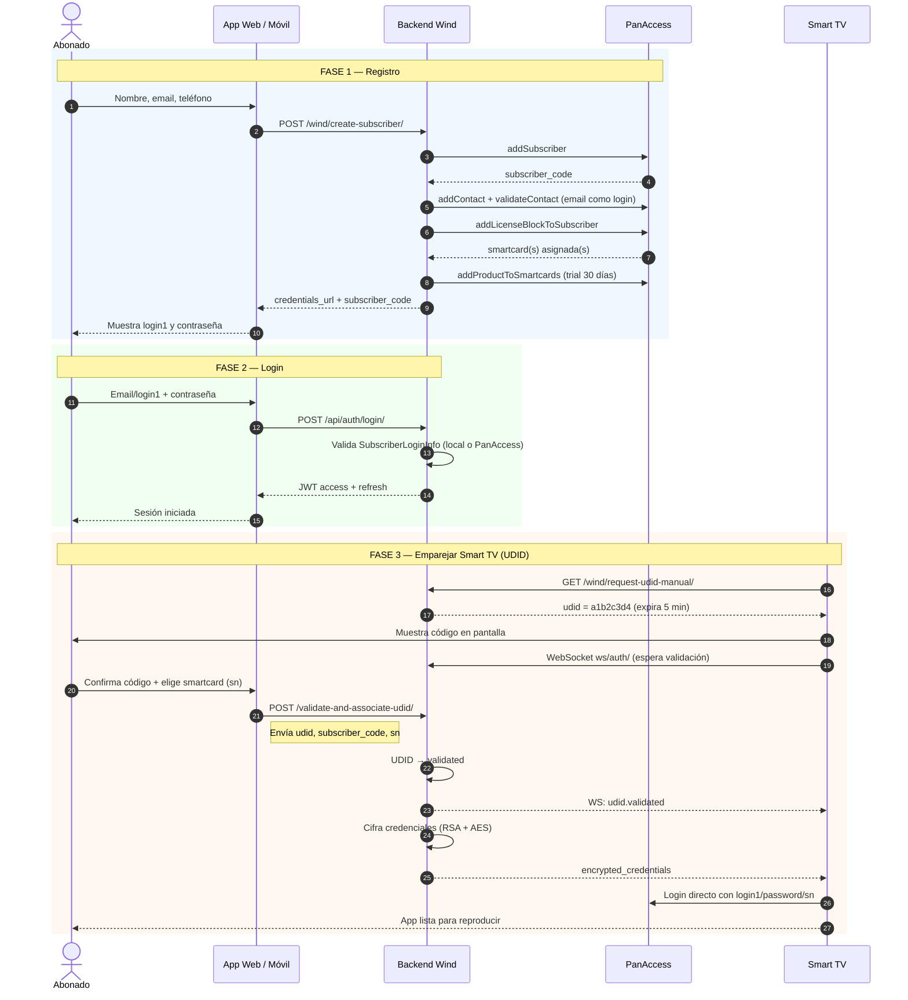
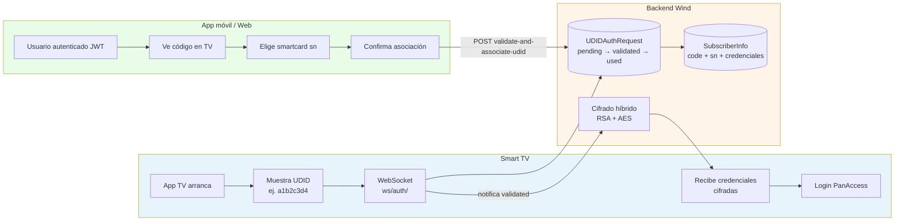

# PanAccess Wind Integration

## ¿Qué es este proyecto?

**PanAccess Wind Integration** es el **backend (servidor)** que conecta las aplicaciones de Wind — portal web, apps móviles y Smart TVs — con **PanAccess**, el sistema donde viven los abonados de TV, sus decodificadores (smartcards), licencias y productos.

No es la app que ve el usuario final. No es PanAccess. Es la **capa intermedia** que:

- Habla con PanAccess en nombre de Wind.
- Guarda una copia local de los datos para responder rápido.
- Gestiona registro, login y emparejamiento de televisores.
- Expone APIs REST y WebSockets para que los frontends no tengan que integrarse directamente con PanAccess.

```
  Usuario          Frontends Wind              ESTE PROYECTO              PanAccess
  ───────          ──────────────              ─────────────              ─────────
  Abonado    →     Web / App / TV       →      Django + API        →     Sistema maestro
  Operador   →     Panel admin          →      Sync + Celery         →     Abonados, SC, productos
```

### En una frase

> Wind no habla con PanAccess directamente: **todas las apps pasan por este backend**, que traduce peticiones, mantiene sesión con PanAccess, cachea datos y aplica las reglas de negocio de Wind (registro único por email, emparejamiento TV, login social, etc.).

---

## Cómo funciona (visión general)

El sistema tiene **cuatro trabajos principales**. Cada uno responde a una necesidad concreta del negocio:

| # | Trabajo | Qué hace | Quién lo usa |
|---|---------|----------|--------------|
| 1 | **Registro y login** | Crea abonados en PanAccess, valida email, asigna licencia trial y devuelve credenciales (`login1`, contraseña). Soporta login clásico, JWT y Google/Facebook. | Abonado, apps móvil/web |
| 2 | **Espejo de datos (sync)** | Cada X minutos (Celery) copia suscriptores, smartcards y productos de PanAccess a PostgreSQL local. Por la noche hace un “full sync” correctivo. | Sistema (automático), operadores |
| 3 | **API de perfil** | Con un token JWT, la app consulta datos del abonado, sus smartcards y productos contratados sin llamar a PanAccess en cada pantalla. | Apps autenticadas |
| 4 | **Emparejamiento Smart TV (UDID)** | La TV muestra un código de 8 caracteres; el usuario lo confirma en el móvil; el backend entrega credenciales **cifradas** a la TV por WebSocket. | Smart TV + app móvil |

### Recorrido típico de un abonado nuevo

```
1. REGISTRO     Usuario rellena formulario → backend crea abonado en PanAccess
                → PanAccess asigna smartcard(s) → backend muestra login1/contraseña

2. LOGIN        Usuario entra con email o login1 → backend valida y devuelve JWT

3. EMPAREJAR TV TV pide código → usuario lo valida en el móvil eligiendo su smartcard
                → TV recibe credenciales cifradas → app de TV inicia sesión en PanAccess
```

#### Diagrama: vida completa del abonado (registro → login → TV)



#### Diagrama: emparejamiento TV (UDID) — detalle



**Puntos clave del emparejamiento:**

- El **UDID** lo genera la TV; el **sn** (smartcard) lo elige el usuario en el móvil.
- La TV **espera** por WebSocket hasta que el móvil confirma (máx. ~5 min).
- Las credenciales viajan **cifradas**; la TV las descifra con la clave pública embebida en la app.

---

### Recorrido típico del sistema (sin intervención humana)

```
Celery Beat (cada 10 min)  →  compare suscriptores y smartcards con PanAccess
Celery Beat (medianoche)   →  full sync: alinea todo + limpia registros huérfanos
Redis                      →  cola de tareas, locks, sesión PanAccess compartida
PostgreSQL                 →  copia local consultable por las APIs
```

---

## Preguntas frecuentes (para aclarar dudas)

### ¿Este proyecto reemplaza a PanAccess?

**No.** PanAccess sigue siendo la **fuente de verdad**: ahí se crean abonados, se asignan licencias y se gestionan productos. Este backend **orquesta** esas operaciones y **replica** datos para uso interno de Wind.

### ¿Por qué hay base de datos local si ya existe PanAccess?

Por **rendimiento**, **resiliencia** y **autonomía de las apps**:

- Las consultas de perfil no golpean PanAccess en cada request.
- Se pueden aplicar reglas propias (un email = una cuenta, auditoría UDID, throttling).
- El sync programado mantiene los datos razonablemente actualizados aunque PanAccess tarde en responder.

### ¿Qué es una smartcard y quién la elige?

La **smartcard** (`sn`) es el identificador del decodificador/licencia del abonado en PanAccess.

| Momento | Quién elige la smartcard |
|---------|--------------------------|
| **Registro** | PanAccess, al ejecutar `addLicenseBlockToSubscriber`. El backend aplica el producto trial a **todas** las que devuelva. |
| **Emparejamiento TV (UDID)** | **El usuario/app móvil**, que envía el `sn` concreto al confirmar el código. El backend **no** elige automáticamente entre varias. |

### ¿Qué es el UDID?

Un **código temporal de 8 caracteres** (ej. `a1b2c3d4`) que aparece en la pantalla de la TV. El abonado lo introduce o confirma desde el móvil. Tras validarlo, la TV recibe sus credenciales PanAccess cifradas. Expira en **5 minutos** si nadie lo confirma.

### ¿Qué diferencia hay entre `/wind/` y `/api/`?

| Prefijo | Propósito |
|---------|-----------|
| **`/api/`** | API REST para apps (JWT, perfil, estado de tareas). Contrato estable para integraciones. |
| **`/wind/`** | Portal web HTML, registro, UDID, sync admin y endpoints de operaciones. Mezcla UI de prueba y APIs legacy. |

### ¿Necesito Redis y Celery sí o sí?

| Componente | ¿Obligatorio? | Sin él… |
|------------|---------------|---------|
| **PostgreSQL** | Recomendado (prod) | Funciona con SQLite en dev |
| **Redis** | Sí en producción | No hay WebSocket UDID, ni Celery, ni caché compartida |
| **Celery Worker + Beat** | Sí en producción | No hay sync automático; habría que ejecutarlo manualmente |

### ¿Qué entrega el login social (Google/Facebook)?

Además del **JWT de Django** (`access` / `refresh`), la respuesta incluye **`panaccess_credentials`**: `login1`, `password`, `login2` y `subscriberCode`. Así la app puede autenticarse también directamente contra PanAccess si lo necesita. Si el email no existía, el backend **crea el abonado en PanAccess** automáticamente.

### ¿Qué NO hace este proyecto?

- No es un reproductor de video ni un CDN.
- No sustituye el panel de administración de PanAccess.
- No incluye los frontends de Wind (React, apps nativas, app de TV); solo el **backend** que ellos consumen.
- No gestiona facturación ni pasarelas de pago (salvo flags `has_purchased` para reglas de re-registro).

---

## Documentación completa

El resto de este README detalla arquitectura, endpoints, variables de entorno, flujos paso a paso, modelos de datos, tareas Celery y limitaciones conocidas del código.

---

## Tabla de contenidos

1. [Resumen ejecutivo](#1-resumen-ejecutivo)
2. [Arquitectura del sistema](#2-arquitectura-del-sistema)
3. [Stack tecnológico](#3-stack-tecnológico)
4. [Estructura del repositorio](#4-estructura-del-repositorio)
5. [Instalación y ejecución](#5-instalación-y-ejecución)
6. [Configuración (variables de entorno)](#6-configuración-variables-de-entorno)
7. [Modelos de datos](#7-modelos-de-datos)
8. [Integración con PanAccess](#8-integración-con-panaccess)
9. [Catálogo de endpoints HTTP](#9-catálogo-de-endpoints-http)
10. [WebSocket (emparejamiento Smart TV)](#10-websocket-emparejamiento-smart-tv)
11. [Flujos de negocio detallados](#11-flujos-de-negocio-detallados)
12. [Tareas Celery y sincronización](#12-tareas-celery-y-sincronización)
13. [Autenticación y autorización](#13-autenticación-y-autorización)
14. [Seguridad y cifrado](#14-seguridad-y-cifrado)
15. [Logging, observabilidad y health checks](#15-logging-observabilidad-y-health-checks)
16. [Referencia de módulos y funciones](#16-referencia-de-módulos-y-funciones)
17. [Limitaciones conocidas y dependencias faltantes](#17-limitaciones-conocidas-y-dependencias-faltantes)
18. [Tests](#18-tests)

---

## 1. Resumen ejecutivo

> La explicación ampliada está al [inicio del documento](#qué-es-este-proyecto). Aquí, el resumen técnico para referencia rápida.

### Rol en el ecosistema Wind

| Sistema | Rol |
|---------|-----|
| **PanAccess** | Maestro: abonados, licencias, smartcards, productos |
| **Este backend** | Integrador + caché + auth + reglas Wind |
| **Frontends Wind** | UX: web, móvil, TV (consumen `/api/` y `/wind/`) |

### Capacidades implementadas

| Capacidad | Descripción |
|-----------|-------------|
| **Espejo local** | Sync de suscriptores, smartcards, productos y credenciales en PostgreSQL |
| **Portal de autenticación** | JWT, registro HTTP, login social Google/Facebook |
| **API de perfil** | `/api/v1/profile/*` para apps autenticadas |
| **Emparejamiento Smart TV** | UDID + WebSocket + credenciales cifradas RSA/AES |
| **Operaciones admin** | Sync manual/async, full-sync, diagnóstico sesión PanAccess |

### Actores

- **Abonado**: registro, login, empareja TV.
- **App móvil / web**: consume API REST y confirma UDID.
- **Smart TV**: genera UDID, recibe credenciales por WebSocket.
- **Operador / admin**: sync, monitoreo tareas Celery, health checks.
- **PanAccess API**: destino final de toda operación de abonado.

### Configuración regional

- Idioma: **español**
- Zona horaria: **`America/Santo_Domingo`**

---

## 2. Arquitectura del sistema

```
┌─────────────────────────────────────────────────────────────────────────┐
│                         CLIENTES                                        │
│  Portal Web (/wind/)  │  Apps REST (/api/)  │  Smart TV (WS + HTTP)    │
└────────────┬────────────────────┬───────────────────────┬───────────────┘
             │                    │                       │
             ▼                    ▼                       ▼
┌─────────────────────────────────────────────────────────────────────────┐
│                    Django 5 + DRF + Channels (Daphne)                   │
│  ┌──────────────┐ ┌──────────────┐ ┌──────────────┐ ┌─────────────────┐ │
│  │ Auth JWT     │ │ Sync Engine  │ │ UDID Pairing │ │ Profile API v1  │ │
│  │ Social Login │ │ Celery Tasks │ │ WebSocket    │ │ Subscriber Cat. │ │
│  └──────────────┘ └──────────────┘ └──────────────┘ └─────────────────┘ │
│                              │                                          │
│                    PanAccessSingleton + Circuit Breaker                 │
└──────────────────────────────┼──────────────────────────────────────────┘
                               │
         ┌─────────────────────┼─────────────────────┐
         ▼                     ▼                     ▼
   PostgreSQL            Redis (DB 0,1,2)      PanAccess HTTP API
   (réplica opcional)   Celery / Cache / WS    ?f=funcName&requestMode=function
```

### Componentes de infraestructura

| Componente | Uso |
|------------|-----|
| **PostgreSQL** | Persistencia principal (SQLite en dev si no hay `DB_ENGINE`). |
| **Redis DB 0** | Broker Celery, locks de tareas, sesión PanAccess compartida, flags de full-sync. |
| **Redis DB 1** | Caché Django (`django-redis`). |
| **Redis DB 2** | Channel layer de Django Channels (WebSockets). |
| **Celery Worker** | Ejecución asíncrona de sincronizaciones. |
| **Celery Beat** | Sync incremental programado + full-sync nocturno. |
| **Sentry** (opcional) | Trazas y alertas de errores. |

### Patrón de acceso a PanAccess

Todas las llamadas remotas pasan por `get_panaccess()` → `PanAccessSingleton`:

1. Carga sesión desde Redis (si está habilitado) o autentica con `login()`.
2. Ejecuta `PanAccessClient.call(func_name, parameters)`.
3. Reintenta con re-login si la sesión expira.
4. Opcionalmente protegido por **circuit breaker** (abierto tras N fallos consecutivos).

---

## 3. Stack tecnológico

| Tecnología | Versión (requirements.txt) | Rol |
|------------|---------------------------|-----|
| Python | 3.x | Runtime |
| Django | 5.2.14 | Framework web |
| Django REST Framework | 3.17.1 | API REST |
| djangorestframework-simplejwt | 5.5.1 | Tokens JWT |
| django-allauth | 65.16.1 | Login social |
| dj-rest-auth | 7.2.0 | Auth REST + registro |
| Celery | 5.6.3 | Tareas asíncronas |
| Redis | 7.4.0 | Broker, caché, channels |
| channels + channels-redis | 4.2.x | WebSockets |
| Daphne | 4.2.1 | Servidor ASGI |
| cryptography | 48.0.0 | Cifrado Fernet + RSA/AES |
| psycopg-binary | ≥3.2 | Driver PostgreSQL |
| phonenumbers | 9.0.30 | Validación teléfonos |
| Sentry SDK | ≥2.19 | Observabilidad |
| WhiteNoise | 6.12.0 | Archivos estáticos |

---

## 4. Estructura del repositorio

```
panaccess_wind_integration/
├── manage.py                    # CLI Django
├── requirements.txt             # Dependencias Python
├── appConfig.py                 # Configuración centralizada desde .env
├── .env                         # Variables de entorno (NO commitear)
├── README.md                    # Este documento
│
├── panaccess_wind_integration/  # Proyecto Django
│   ├── settings.py              # Settings completos
│   ├── urls.py                  # Rutas raíz
│   ├── wsgi.py                  # WSGI
│   ├── asgi.py                  # ASGI (HTTP + WebSocket)
│   └── celery.py                # App Celery
│
└── wind/                        # App principal
    ├── models.py                # Modelos ORM
    ├── urls.py                  # Rutas /wind/
    ├── views.py                 # Vistas web + UDID APIViews
    ├── auth_views.py            # Login social REST
    ├── auth_serializers.py      # Serializers de login
    ├── serializers.py           # Serializers generales
    ├── adapters.py              # Adaptador Allauth + PanAccess
    ├── tasks.py                 # Tareas Celery
    ├── consumers.py             # WebSocket consumer
    ├── routing.py               # Rutas WebSocket
    ├── exceptions.py            # Excepciones PanAccess
    ├── db_router.py             # Router lectura réplica
    │
    ├── api/                       # API versionada /api/v1/
    │   ├── urls.py
    │   ├── task_views.py
    │   └── profile/
    │
    ├── functions/               # Lógica de negocio + vistas sync
    │   ├── create_subscriber.py
    │   ├── getSubscriber.py
    │   ├── getSmartcard.py
    │   ├── getProducts.py
    │   ├── getSubscriberLoginInfo.py
    │   ├── sync_*.py
    │   ├── full_sync.py
    │   └── ...
    │
    ├── services/                # Servicios de infraestructura
    │   ├── panaccess_client.py
    │   ├── panaccess_singleton.py
    │   ├── panaccess_session_store.py
    │   ├── panaccess_circuit_breaker.py
    │   ├── subscriber_auth.py
    │   ├── subscriber_catalog.py
    │   ├── udid_auth_service.py
    │   └── sync_http.py
    │
    ├── utils/                   # Utilidades transversales
    │   ├── panaccess_auth.py
    │   ├── encryption.py
    │   ├── crypto_tv.py
    │   ├── email_validation.py
    │   ├── phone_validation.py
    │   ├── websocket_utils.py
    │   └── ...
    │
    └── tests/
        └── test_auth.py
```

---

## 5. Instalación y ejecución

### Requisitos previos

- Python 3.11+ recomendado
- PostgreSQL (producción) o SQLite (desarrollo)
- Redis en ejecución
- Credenciales válidas de PanAccess en `.env`

### Pasos básicos

```bash
# 1. Entorno virtual
python -m venv venv
venv\Scripts\activate          # Windows
# source venv/bin/activate     # Linux/macOS

# 2. Dependencias
pip install -r requirements.txt

# 3. Configurar .env (ver sección 6)

# 4. Migraciones
python manage.py migrate

# 5. Servidor de desarrollo (HTTP + WebSocket vía Daphne)
python manage.py runserver

# 6. Worker Celery (terminal separada)
celery -A panaccess_wind_integration worker -l info -Q sync_subscribers

# 7. Celery Beat (terminal separada)
celery -A panaccess_wind_integration beat -l info
```

### Servicios en producción

- **HTTP/ASGI**: Daphne u otro servidor ASGI compatible con Channels.
- **Worker Celery**: pool `prefork` en Linux; `solo` en Windows (configurable vía `CELERY_WORKER_POOL`).
- **Beat**: una sola instancia para evitar schedules duplicados.

---

## 6. Configuración (variables de entorno)

Toda la configuración se centraliza en `appConfig.py` y se carga desde `.env`.

### Django / Seguridad

| Variable | Obligatoria | Descripción |
|----------|-------------|-------------|
| `SECRET_KEY` | Sí | Clave secreta Django |
| `DEBUG` | No | `true`/`false` (default: false) |
| `ALLOWED_HOSTS` | Sí | Hosts separados por coma |
| `PRODUCTION_HTTPS` | No | Activa HSTS, cookies secure, redirect SSL |
| `SYNC_ADMIN_IP_ALLOWLIST` | No | IPs permitidas para middleware sync admin |

### CORS

| Variable | Descripción |
|----------|-------------|
| `CORS_ALLOWED_ORIGINS` | Orígenes permitidos (sin barra final) |
| `CORS_DEV_DEFAULTS` | Si true y sin orígenes, usa localhost:3000/5173 |
| `CORS_ALLOW_CREDENTIALS` | Permite cookies cross-origin |

### Base de datos

| Variable | Descripción |
|----------|-------------|
| `DB_ENGINE` | Ej: `django.db.backends.postgresql` |
| `DB_NAME`, `DB_USER`, `DB_PASSWORD`, `DB_HOST`, `DB_PORT` | Conexión PostgreSQL |
| `DB_CONN_MAX_AGE` | Persistencia de conexiones (segundos) |
| `DB_REPLICA_HOST`, `DB_REPLICA_PORT` | Réplica de lectura (opcional) |

### Redis / Celery

| Variable | Default | Descripción |
|----------|---------|-------------|
| `REDIS_HOST` | localhost | Host Redis |
| `REDIS_PORT` | 6379 | Puerto |
| `REDIS_DB` | 0 | DB para Celery/locks/sesión |
| `REDIS_CACHE_DB` | 1 | DB para caché Django |
| `REDIS_PASSWORD` | — | Password Redis |
| `CELERY_BROKER_URL` | — | Override URL broker |
| `CELERY_TASK_ALWAYS_EAGER` | false | Ejecuta tareas en proceso (tests/dev) |
| `CELERY_SYNC_MINUTES` | 10 | Intervalo sync suscriptores |
| `CELERY_SMARTCARD_SYNC_MINUTES` | 10 | Intervalo sync smartcards |
| `CELERY_SYNC_LIMIT` | 200 | Registros por página en sync |
| `CELERY_FULL_SYNC_ENABLED` | true | Activa full-sync nocturno |
| `CELERY_FULL_SYNC_HOUR` | 0 | Hora full-sync (0-23) |
| `CELERY_FULL_SYNC_MINUTE` | 0 | Minuto full-sync |
| `CELERY_WORKER_POOL` | solo (Win) / prefork | Pool del worker |

### PanAccess

| Variable | Obligatoria | Descripción |
|----------|-------------|-------------|
| `url_panaccess` | Sí | URL base API PanAccess |
| `username` | Sí | Usuario operador PanAccess |
| `password` | Sí | Contraseña (se hashea MD5+salt al login) |
| `api_token` | Sí | Token API |
| `salt` | Sí | Salt para hash de contraseña |
| `hcId` o `hcid` | Sí | Headend ID |
| `ENCRYPTION_KEY` | Sí | Clave Fernet (base64) para cifrado local |
| `PANACCESS_REGISTRATION_PRODUCT_ID` | No | Producto trial al registrar (default: 4639) |
| `PANACCESS_SESSION_USE_REDIS` | Auto | Compartir sessionId entre workers |
| `PANACCESS_SESSION_TTL_SECONDS` | 1500 | TTL sesión en Redis |
| `PANACCESS_CIRCUIT_BREAKER_ENABLED` | Auto | true en prod, false en DEBUG |
| `PANACCESS_CB_FAILURE_THRESHOLD` | 5 | Fallos antes de abrir circuit breaker |
| `PANACCESS_CB_RECOVERY_SECONDS` | 60 | Segundos antes de half-open |

### JWT / Email / Social

| Variable | Descripción |
|----------|-------------|
| `JWT_USE_COOKIES` | JWT en cookies HTTP |
| `JWT_ACCESS_MINUTES` | Duración access token |
| `EMAIL_*` | Configuración SMTP |
| `ACCOUNT_EMAIL_VERIFICATION` | none / optional / mandatory |
| `SOCIAL_LOGIN_PROVIDERS` | google,facebook,apple |
| `GOOGLE_*`, `FACEBOOK_*`, `APPLE_*` | Credenciales OAuth |

### Feature flags

| Variable | Default | Descripción |
|----------|---------|-------------|
| `SYNC_HTTP_ASYNC` | true | POST sync encola Celery (202) |
| `FULL_SYNC_HTTP_ENABLED` | false | Permite POST /wind/full-sync/ |
| `PANACCESS_OPS_HTTP_ENABLED` | false | Endpoints ops PanAccess vía HTTP |
| `CREATE_SUBSCRIBER_PUBLIC_ENABLED` | true | Registro público HTTP |

### Observabilidad

| Variable | Descripción |
|----------|-------------|
| `SENTRY_DSN` | DSN de Sentry |
| `SENTRY_ENVIRONMENT` | Nombre del entorno |
| `SENTRY_TRACES_SAMPLE_RATE` | 0.1 por defecto |

---

## 7. Modelos de datos

### 7.1 Caché desde PanAccess

#### `ListOfSubscriber`
Espejo de abonados PanAccess.

Campos principales: `id`, `code`, `firstName`, `lastName`, `emails`, `phones`, `smartcards` (JSON), `regionId`, `countryCode`, direcciones, fechas de orden/expiración.

#### `ListOfSmartcards`
Detalle por smartcard: `sn`, `subscriberCode`, `pin`, `products`, `packages`, `mac`, `firmwareVersion`, flags `blacklisted`/`disabled`/`defect`, etc.

#### `ListOfProducts`
Catálogo de productos/paquetes: `productId`, `name`, `packages`, `streams`, `vodLibraries`, etc.

### 7.2 Autenticación

#### `SubscriberLoginInfo`
Credenciales PanAccess por abonado: `login1`, `login2`, `password_hash` (Fernet), `licenses`.

Métodos: `set_password()`, `get_password()`, `check_password()`.

#### `SubscriberInfo`
Perfil activo del abonado **por smartcard** (par `subscriber_code` + `sn`).

Incluye: credenciales, PIN, productos, paquetes, bloqueo por intentos fallidos (`failed_login_attempts`, `locked_until`).

> **Nota importante**: Este modelo es requerido por el flujo UDID, pero **no se puebla automáticamente** en registro ni sync (ver sección 17).

### 7.3 Antifraude / unicidad

#### `SubscriberEmailRegistry`
Un email → un suscriptor. Campo `has_purchased` permite excepción para re-registro.

#### `SubscriberDocumentRegistry`
Un documento de identidad → un suscriptor (misma lógica de `has_purchased`).

### 7.4 Smart TV

#### `AppCredentials`
Par RSA por tipo de app (`android_tv`, `samsung_tv`, `lg_tv`, `set_top_box`, `mobile_app`, `web_player`).

#### `UDIDAuthRequest`
Código de emparejamiento (8 hex). Estados: `pending` → `validated` → `used` | `expired` | `revoked`.

Expira en **5 minutos** en estado pending. Tras validación, la expiración se congela.

#### `EncryptedCredentialsLog`
Auditoría de credenciales cifradas enviadas a TVs.

### 7.5 Auditoría

#### `AuthAuditLog`
Eventos: `udid_generated`, `udid_validated`, `udid_used`, `login_attempt`, `login_success`, `login_failed`, `account_locked`, etc.

#### `UserProfile`
Extensión del `User` Django: `operator_code`, `document_number`.

---

## 8. Integración con PanAccess

### Protocolo de comunicación

```
POST {url_panaccess}?f={nombreFuncion}&requestMode=function
Content-Type: application/x-www-form-urlencoded

Parámetros incluyen sessionId (excepto login/cvLoggedIn)
```

### Autenticación (`wind/utils/panaccess_auth.py`)

1. `hash_password(password)` → MD5(password + salt)
2. `login()` → envía username, password hasheado, apiToken → retorna `sessionId`
3. `logged_in(sessionId)` → valida si la sesión sigue activa

### Funciones PanAccess invocadas por el proyecto

| Función PanAccess | Módulo que la usa | Propósito |
|-------------------|-------------------|-----------|
| `login` | panaccess_auth | Obtener sessionId |
| `cvLoggedIn` | panaccess_auth | Validar sesión |
| `cvLogout` | panaccess_client | Cerrar sesión |
| `addSubscriber` | create_subscriber | Crear abonado |
| `addContactToSubscriber` | create_subscriber | Añadir email/teléfono |
| `validateContactOfSubscriber` / `cvValidateContactOfSubscriber` | create_subscriber | Validar email como login |
| `addLicenseBlockToSubscriber` | create_subscriber | Asignar licencia streaming → smartcard(s) |
| `addProductToSmartcards` | create_subscriber | Producto trial a smartcards |
| `getSubscriber` / `getExtendedSubscriber` | getSubscriber | Detalle de un abonado |
| `getListOfExtendedSubscribers` | getSubscriber | Listado paginado abonados |
| `getListOfSmartcards` | getSmartcard | Listado smartcards |
| `getSmartcard` / variantes | getSmartcard | Detalle por SN |
| `getListOfProducts` | getProducts | Catálogo productos |
| `getSubscriberLoginInfo` | getSubscriberLoginInfo | Credenciales login1/login2/password |
| `getListOfSubscriberLoginInfo` (+ variantes) | getSubscriberLoginInfo | Listado masivo login info |
| `resetSubscriberPassword` | change_password, profile | Cambio de contraseña |

### Cliente y singleton

- **`PanAccessClient`**: HTTP con reintentos, backoff exponencial, serialización JSON de parámetros complejos.
- **`PanAccessSingleton`**: instancia thread-safe única; validación periódica de sesión cada 15 minutos.
- **`panaccess_session_store`**: persiste `sessionId` en Redis para workers Celery concurrentes.
- **`PanAccessCircuitBreaker`**: corta llamadas tras umbral de fallos; recuperación tras timeout.

---

## 9. Catálogo de endpoints HTTP

### Leyenda de permisos

| Símbolo | Significado |
|---------|-------------|
| 🔓 | Público (`AllowAny`) |
| 🔐 | Autenticado (`IsAuthenticated` + JWT) |
| 👑 | Admin (`IsAdminUser`) |
| 🛡️ | Autenticado + propietario del suscriptor |

---

### 9.1 Raíz del proyecto (`panaccess_wind_integration/urls.py`)

| Método | Ruta | Permiso | Descripción |
|--------|------|---------|-------------|
| GET | `/health/` | 🔓 | Health check liveness |
| GET | `/ready/` | 🔓 | Readiness (BD, Redis, etc.) |
| * | `/admin/` | 👑 | Django Admin |
| * | `/accounts/` | 🔓 | Flujos HTML Allauth (Google/Facebook) |
| * | `/api/auth/` | 🔓/🔐 | Login, logout, refresh JWT (dj-rest-auth) |
| * | `/api/auth/registration/` | 🔓 | Registro usuario Django |
| * | `/api/v1/` | 🔐 | API versionada (perfil, tareas) |
| * | `/wind/` | Mixto | Portal web + operaciones |

---

### 9.2 Autenticación JWT (`/api/auth/`)

Provisto por **dj-rest-auth** + **SimpleJWT**.

| Endpoint típico | Método | Body | Respuesta |
|-----------------|--------|------|-----------|
| `/api/auth/login/` | POST | `{ "username": "...", "password": "..." }` | `{ "access", "refresh", "user" }` |
| `/api/auth/logout/` | POST | Header `Authorization: Bearer {access}` | 200 |
| `/api/auth/token/refresh/` | POST | `{ "refresh": "..." }` | Nuevo access token |

**Login personalizado** (`PanAccessLoginSerializer`):

- `username` acepta: `login1` numérico, `login2`, código de suscriptor o email.
- Valida contra `SubscriberLoginInfo` local o PanAccess vía `subscriber_auth.authenticate_portal_user()`.
- Crea/vincula `User` Django automáticamente.

---

### 9.3 API v1 — Perfil (`/api/v1/profile/`)

| Método | Ruta | Permiso | Descripción |
|--------|------|---------|-------------|
| GET | `/api/v1/profile/me/` | 🔐 | Datos del suscriptor vinculado al usuario JWT |
| GET | `/api/v1/profile/subscriber/` | 🔐 | Detalle extendido del suscriptor |
| GET | `/api/v1/profile/products/` | 🔐 | Smartcards y productos del abonado |
| POST | `/api/v1/profile/password/` | 🔐 🛡️ | Cambio contraseña PanAccess (`code`, `newPass`) |

**Throttle**: `ProfileThrottle` (120/min por defecto).

**Resolución de suscriptor**: `resolve_subscriber_code_for_user()` busca en `SubscriberEmailRegistry` por email del `User`.

---

### 9.4 API v1 — Tareas (`/api/v1/tasks/`)

| Método | Ruta | Permiso | Descripción |
|--------|------|---------|-------------|
| GET | `/api/v1/tasks/{task_id}/` | 👑 | Estado de tarea Celery encolada |

Respuesta: `{ task_id, state, ready, successful, result?, error? }`.

---

### 9.5 Portal web y pruebas (`/wind/`)

| Método | Ruta | Permiso | Descripción |
|--------|------|---------|-------------|
| GET | `/wind/` | 🔓 | Página login (HTML) |
| GET | `/wind/login/` | 🔓 | Alias login |
| GET | `/wind/dashboard/` | 🔓 | Dashboard usuario (JWT en browser) |
| GET | `/wind/register/` | 🔓 | Formulario registro web |
| GET | `/wind/credentials/?t={token}` | 🔓 | Muestra credenciales post-registro (token firmado, 10 min) |
| GET | `/wind/login-test/` | 🔓 | Prueba login Google HTML |
| GET | `/wind/login-test-facebook/` | 🔓 | Prueba login Facebook SDK |
| GET | `/wind/subscriber-test/` | 🔓 | Prueba perfil con logs |

---

### 9.6 Login social REST (`/wind/auth/`)

| Método | Ruta | Body | Respuesta extra |
|--------|------|------|-----------------|
| POST | `/wind/auth/google/` | `{ "access_token": "<Google JWT>" }` | `panaccess_credentials`: login1, password, login2, subscriberCode |
| POST | `/wind/auth/facebook/` | `{ "access_token": "<FB token>" }` | Idem |

Si no existe `SubscriberEmailRegistry`, intenta **auto-provisionar** suscriptor vía `create_subscriber_in_panaccess()`.

**Adaptador Allauth** (`PanAccessSocialAccountAdapter`): en login social nativo (HTML), crea suscriptor en PanAccess si el email no está registrado.

---

### 9.7 Registro de abonados

| Método | Ruta | Permiso | Throttle |
|--------|------|---------|----------|
| POST | `/wind/create-subscriber/` | 🔓* | RegisterThrottle (10/h) |

\* Requiere `CREATE_SUBSCRIBER_PUBLIC_ENABLED=true` o llamada interna.

**Body JSON**:

```json
{
  "firstName": "Juan",
  "lastName": "Pérez",
  "email": "juan@example.com",
  "phone": "8095551234",
  "code": "OPCIONAL",
  "comment": "OPCIONAL",
  "countryCode": "DO"
}
```

**Respuesta 201** (campos principales):

```json
{
  "success": true,
  "subscriber_code": "AUTO42",
  "alternative_login": "juan@example.com",
  "email_validated": true,
  "license_block_added": true,
  "assigned_smartcards": ["1234567890"],
  "product_add_result": { "success": true, "productId": 4639 },
  "credentials_url": "/wind/credentials/?t=..."
}
```

Ver [Flujo de registro](#111-flujo-de-registro-de-abonados) para detalle paso a paso.

---

### 9.8 Emparejamiento UDID (Smart TV)

| Método | Ruta | Permiso | Descripción |
|--------|------|---------|-------------|
| GET | `/wind/request-udid-manual/` | 🔓 | Genera código UDID (8 hex, expira 5 min) |
| POST | `/wind/validate-and-associate-udid/` | 🔓 | Asocia UDID con suscriptor + smartcard SN |
| POST | `/wind/authenticate-with-udid/` | 🔓 | Entrega credenciales cifradas |
| GET | `/wind/validate/?udid=` | 🔓 | Polling estado UDID |
| POST | `/wind/disassociate-udid/` | 🔓 | Revoca asociación SN ↔ UDID |

#### POST `/wind/validate-and-associate-udid/`

```json
{
  "udid": "a1b2c3d4",
  "subscriber_code": "AUTO42",
  "sn": "1234567890",
  "operator_id": "user@email.com",
  "method": "automatic"
}
```

**Validaciones**:
- UDID existe y está `pending`.
- `SubscriberInfo` existe con ese `sn`.
- `sn` pertenece al `subscriber_code` indicado.
- Cuenta no bloqueada.
- SN no asociado a otro UDID activo.

> La smartcard **no se selecciona automáticamente**: el cliente debe enviar el `sn` explícitamente.

#### POST `/wind/authenticate-with-udid/`

```json
{
  "udid": "a1b2c3d4",
  "app_type": "android_tv",
  "app_version": "1.0"
}
```

`app_type` válidos: `android_tv`, `samsung_tv`, `lg_tv`, `set_top_box`, `mobile_app`, `web_player`.

---

### 9.9 Sincronización (admin)

Todos requieren **👑 IsAdminUser** y throttle `SyncAdminThrottle` (30/min).

| Método | Ruta | Celery Task | Descripción |
|--------|------|-------------|-------------|
| GET/POST | `/wind/sync-subscribers/` | `sync_subscribers_task` | Descarga incremental suscriptores |
| GET/POST | `/wind/compare-and-update-subscribers/` | `compare_and_update_subscribers_task` | Compare/update suscriptores |
| GET/POST | `/wind/sync-smartcards/` | `sync_smartcards_task` | Sync smartcards |
| GET/POST | `/wind/compare-and-update-smartcards/` | `compare_and_update_smartcards_task` | Compare/update smartcards |
| GET/POST | `/wind/sync-products/` | `sync_products_task` | Sync productos |
| GET/POST | `/wind/full-sync/` | `full_sync_task` | Sync global (requiere `FULL_SYNC_HTTP_ENABLED=true`) |

**Comportamiento POST** (default `SYNC_HTTP_ASYNC=true`):

- Responde **202 Accepted** con `{ task_id, status_url: "/api/v1/tasks/{id}/" }`.
- Con `SYNC_HTTP_ASYNC=false`, ejecuta síncronamente y responde 200.

**Endpoints de diagnóstico**:

| Ruta | Descripción |
|------|-------------|
| `/wind/test-call-list-products/` | Prueba API listado productos |
| `/wind/products-stats/` | Estadísticas productos locales |
| `/wind/test-call-list-smartcards/` | Prueba API listado smartcards |
| `/wind/smartcards-stats/` | Estadísticas smartcards locales |

---

### 9.10 Operaciones PanAccess (ops)

Requieren `PANACCESS_OPS_HTTP_ENABLED=true` (default: false).

| Método | Ruta | Descripción |
|--------|------|-------------|
| GET | `/wind/ops/panaccess-session/` | Estado sesión PanAccess |
| GET | `/wind/logged-in/` | Verifica sesión activa |
| GET | `/wind/singleton/` | Diagnóstico singleton |

---

### 9.11 Cambio de contraseña (legacy)

| Método | Ruta | Permiso | Nota |
|--------|------|---------|------|
| POST | `/wind/change-password/` | 🔐 🛡️ | Preferir `/api/v1/profile/password/` |

Body: `{ "code": "AUTO42", "newPass": "nueva" }` → llama `resetSubscriberPassword` en PanAccess.

---

## 10. WebSocket (emparejamiento Smart TV)

### Conexión

```
ws://{host}/ws/auth/
```

### Protocolo de mensajes

#### Cliente → Servidor

**Iniciar emparejamiento**:
```json
{
  "type": "auth_with_udid",
  "udid": "a1b2c3d4",
  "app_type": "android_tv",
  "app_version": "1.0"
}
```

**Keep-alive**:
```json
{ "type": "ping" }
```

#### Servidor → Cliente

| type | Significado |
|------|-------------|
| `pending` | Esperando validación del UDID |
| `auth_with_udid:result` | Resultado final (credenciales o error) |
| `timeout` | Expiró tiempo de espera |
| `pong` | Respuesta a ping |
| `error` | Error con `code` y `detail` |

### Flujo WebSocket

1. TV conecta y envía `auth_with_udid`.
2. Si UDID no validado → `pending` + suscripción al grupo Redis `udid_{udid}`.
3. Usuario valida desde móvil → `validate-and-associate-udid`.
4. Backend envía evento `udid.validated` al grupo.
5. Consumer llama `authenticate_with_udid_service()` y envía credenciales cifradas.
6. Conexión se cierra.

### Límites WebSocket (configurables en settings)

| Setting | Default | Descripción |
|---------|---------|-------------|
| `UDID_WAIT_TIMEOUT_AUTOMATIC` | 300s | Timeout modo automático |
| `UDID_WAIT_TIMEOUT_MANUAL` | 300s | Timeout modo manual |
| `UDID_WS_PING_INTERVAL` | 30s | Intervalo ping |
| `UDID_WS_INACTIVITY_TIMEOUT` | 180s | Cierre por inactividad |
| `UDID_WS_MAX_PER_TOKEN` | 3 | Conexiones por UDID |
| `UDID_WS_MAX_GLOBAL` | 1000 | Conexiones globales |

---

## 11. Flujos de negocio detallados

### 11.1 Flujo de registro de abonados

```
Cliente POST /wind/create-subscriber/
    │
    ├─ Validar email único (SubscriberEmailRegistry + ListOfSubscriber)
    ├─ Generar o validar código suscriptor (AUTO{n})
    │
    ├─ PanAccess: addSubscriber
    ├─ Local: guardar ListOfSubscriber
    ├─ Local: SubscriberEmailRegistry
    │
    ├─ PanAccess: addContactToSubscriber (email)
    ├─ PanAccess: validateContactOfSubscriber (asLogin=1)
    ├─ PanAccess: addContactToSubscriber (teléfono, opcional)
    │
    ├─ PanAccess: addLicenseBlockToSubscriber
    │     └─ PanAccess asigna smartcard(s) al abonado
    │
    ├─ Actualizar ListOfSubscriber.smartcards
    ├─ PanAccess: addProductToSmartcards (producto trial 30 días a TODAS las SC)
    │
    ├─ Generar token firmado → credentials_url
    └─ Encolar email verificación (Celery)
```

**Producto de registro**: `PANACCESS_REGISTRATION_PRODUCT_ID` (default 4639).

**Quién asigna la smartcard en registro**: PanAccess, vía `addLicenseBlockToSubscriber`. El backend no elige SN; aplica producto a todas las devueltas.

---

### 11.2 Flujo de login con credenciales PanAccess

```
POST /api/auth/login/ { username, password }
    │
    ├─ ¿Usuario Django existe? → authenticate()
    │
    └─ Si no:
         ├─ Buscar SubscriberLoginInfo (login1, login2, código)
         ├─ Si no en BD → fetch_login_info_for_subscriber() desde PanAccess
         ├─ Si login1 numérico → descubrimiento paginado (_discover_login_by_login1)
         ├─ Verificar password (Fernet decrypt)
         └─ get_or_create_portal_user() → User Django + JWT
```

---

### 11.3 Flujo de login social (Google/Facebook)

```
POST /wind/auth/google/ { access_token }
    │
    ├─ Allauth valida token → User Django
    ├─ PanAccessSocialAccountAdapter.pre_social_login:
    │     ├─ ¿Email en SubscriberEmailRegistry? → OK
    │     └─ Si no → create_subscriber_in_panaccess()
    │
    ├─ get_response():
    │     ├─ CallGetSubscriberLoginInfo(subscriber_code)
    │     └─ Adjuntar panaccess_credentials al JSON JWT
    │
    └─ Respuesta: { access, refresh, user, panaccess_credentials }
```

---

### 11.4 Flujo UDID (Smart TV) completo

```
┌──────────┐                    ┌──────────┐                    ┌──────────┐
│ Smart TV │                    │ Backend  │                    │ Móvil/Web│
└────┬─────┘                    └────┬─────┘                    └────┬─────┘
     │ GET /request-udid-manual/     │                               │
     │──────────────────────────────>│                               │
     │<──────────────────────────────│ udid=a1b2c3d4 (pending)       │
     │                               │                               │
     │ WS auth_with_udid             │                               │
     │──────────────────────────────>│                               │
     │<──────────────────────────────│ pending (timeout 300s)      │
     │                               │                               │
     │                               │ POST validate-and-associate   │
     │                               │<──────────────────────────────│
     │                               │ {udid, subscriber_code, sn}   │
     │                               │                               │
     │                               │ UDID → validated              │
     │ WS udid.validated             │                               │
     │<──────────────────────────────│                               │
     │                               │                               │
     │ authenticate_with_udid        │                               │
     │ (automático vía WS)           │                               │
     │<──────────────────────────────│ encrypted_credentials         │
     │                               │ UDID → used                   │
```

**Selección de smartcard**:

| Actor | Responsabilidad |
|-------|-----------------|
| Cliente móvil/web | Elige `sn` y lo envía en `validate-and-associate-udid` |
| Backend | Valida que `sn` exista en `SubscriberInfo` y pertenezca al suscriptor |
| Backend UDID | **No** implementa auto-selección (primera SC, más reciente, etc.) |

**Payload de credenciales cifradas** (antes de cifrar):

```json
{
  "subscriber_code": "AUTO42",
  "sn": "1234567890",
  "login1": 100001,
  "login2": "user@email.com",
  "password": "...",
  "pin": "...",
  "packages": [...],
  "products": [...],
  "timestamp": "2026-06-08T12:00:00+00:00"
}
```

Cifrado: **AES-256-CBC + RSA-OAEP** (`hybrid_encrypt_for_app`).

---

### 11.5 Flujo de sincronización incremental

**Celery Beat** (default cada 10 min):

1. `compare_and_update_subscribers_task` → alinea `ListOfSubscriber` con PanAccess.
2. `compare_and_update_smartcards_task` → alinea `ListOfSmartcards`.

Durante **full_sync** nocturno, las tareas incrementales se **omiten** (flag Redis `celery:flag:full_sync_in_progress`).

**Full sync** (`run_full_sync`):

1. Compare/update suscriptores
2. Sync + compare/update productos + eliminar productos huérfanos
3. Compare/update smartcards
4. Sync login info + cleanup huérfanos

---

### 11.6 Flujo consulta perfil y productos

```
GET /api/v1/profile/products/ (JWT)
    │
    ├─ resolve_subscriber_code_for_user(email → SubscriberEmailRegistry)
    ├─ build_subscriber_products_payload(subscriber_code)
    │     ├─ ListOfSmartcards locales
    │     ├─ Si vacío → fetch_subscriber_smartcards_from_panaccess()
    │     └─ Enriquecer productos desde ListOfProducts
    │
    └─ Respuesta: { smartcards: [...], products: [...] }
```

---

## 12. Tareas Celery y sincronización

### Tareas definidas (`wind/tasks.py`)

| Tarea | Lock Redis | Reintentos | Skip durante full-sync |
|-------|------------|------------|------------------------|
| `sync_subscribers_task` | Sí | 5 (backoff) | Sí |
| `compare_and_update_subscribers_task` | Sí | 5 | Sí |
| `sync_smartcards_task` | Sí | 5 | Sí |
| `compare_and_update_smartcards_task` | Sí | 5 | Sí |
| `sync_products_task` | Sí | 5 | Sí |
| `full_sync_task` | Sí (3600s) | 3 | N/A (es el full-sync) |
| `send_verification_email_task` | No | No | No |

### Schedule Celery Beat (default)

| Tarea | Frecuencia |
|-------|------------|
| `compare_and_update_subscribers_task` | Cada `CELERY_SYNC_MINUTES` (10) |
| `compare_and_update_smartcards_task` | Cada `CELERY_SMARTCARD_SYNC_MINUTES` (10) |
| `full_sync_task` | Diario a `CELERY_FULL_SYNC_HOUR:CELERY_FULL_SYNC_MINUTE` (00:00) |

Cola: `sync_subscribers` (configurable vía `CELERY_SYNC_QUEUE`).

---

## 13. Autenticación y autorización

### Mecanismos

| Mecanismo | Uso |
|-----------|-----|
| JWT Bearer | API REST (`Authorization: Bearer {access}`) |
| Session Django | Portal HTML / Allauth |
| Token firmado | Página credentials post-registro |
| Credenciales PanAccess | Login nativo TV (entregadas cifradas vía UDID) |

### Throttling DRF (defaults)

| Scope | Rate |
|-------|------|
| `anon` | 60/min |
| `user` | 600/min |
| `profile` | 120/min |
| `sync_admin` | 30/min |
| `register` | 10/hour |

### Permisos custom

- **`IsOwnerSubscriber`**: el `code` del body debe corresponder al suscriptor del usuario JWT (cambio contraseña).

---

## 14. Seguridad y cifrado

### Cifrado en reposo (BD local)

- **Fernet** (`ENCRYPTION_KEY`): passwords y PINs en `SubscriberLoginInfo` y `SubscriberInfo`.
- Implementación: `wind/utils/encryption.py`.

### Cifrado en tránsito hacia Smart TV

- **Híbrido RSA + AES-256-CBC** (`wind/utils/crypto_tv.py`).
- Claves RSA por `AppCredentials` (privada en servidor, pública embebida en app TV).

### Protección antifraude registro

- Un email → un suscriptor (`SubscriberEmailRegistry`).
- Un documento → un suscriptor (`SubscriberDocumentRegistry`).
- Excepción si `has_purchased=true`.

### Rate limiting UDID

- Por device fingerprint, UDID, token cliente, conexiones WebSocket.
- Token bucket Lua en Redis.
- Reconexiones legítimas con rate limit adaptativo.

### HTTPS producción

Con `PRODUCTION_HTTPS=true` y `DEBUG=false`:

- HSTS, cookies secure, redirect SSL, `SECURE_PROXY_SSL_HEADER`.

---

## 15. Logging, observabilidad y health checks

### Archivos de log (`logs/`)

| Archivo | Contenido |
|---------|-----------|
| `django.log` | General Django |
| `panaccess.log` | Llamadas PanAccess |
| `tasks.log` | Celery |
| `errors.log` | Solo ERROR |

### Sentry

Integraciones: Django, Celery, Redis. `traces_sample_rate` configurable.

### Health checks

| Endpoint | Propósito |
|----------|-----------|
| `/health/` | Liveness |
| `/ready/` | Readiness (dependencias) |

> Implementados en `wind/views_health.py` (referenciado en urls; ver sección 17 si falta en el repo).

---

## 16. Referencia de módulos y funciones

### `wind/functions/getSubscriber.py`

| Función | Descripción |
|---------|-------------|
| `CallListExtendedSubscribers(offset, limit)` | Lista paginada abonados extendidos |
| `CallGetSubscriber(subscriber_code)` | Detalle de un abonado (múltiples APIs fallback) |
| `sync_subscribers(limit)` | Descarga incremental |
| `compare_and_update_all_subscribers(limit)` | Compare/update + elimina huérfanos |
| `extract_first_email()` / `extract_first_phone()` | Helpers parseo contactos |

### `wind/functions/getSmartcard.py`

| Función | Descripción |
|---------|-------------|
| `CallListSmartcards(offset, limit, subscriber_code?)` | Lista smartcards |
| `CallGetSmartcard(sn)` | Detalle por SN |
| `sync_smartcards(limit)` | Sync incremental |
| `compare_and_update_all_smartcards(limit)` | Compare/update |
| `fetch_subscriber_smartcards_from_panaccess(code, target_sns)` | Fetch para perfil con fallback global |

### `wind/functions/getProducts.py`

| Función | Descripción |
|---------|-------------|
| `CallListOfProducts(offset, limit)` | Lista productos |
| `sync_products(limit)` | Sync incremental |
| `compare_and_update_all_products(limit)` | Compare/update |

### `wind/functions/getSubscriberLoginInfo.py`

| Función | Descripción |
|---------|-------------|
| `CallGetSubscriberLoginInfo(subscriber_code)` | Credenciales de un abonado |
| `CallListSubscriberLoginInfo(offset, limit)` | Listado masivo (auto-detect API) |
| `fetch_login_info_for_subscriber(code)` | Fetch + upsert local |
| `sync_subscribers_login_info(limit)` | Sync masivo login info |
| `cleanup_login_info_orphans()` | Elimina registros sin suscriptor local |

### `wind/services/subscriber_catalog.py`

| Función | Descripción |
|---------|-------------|
| `resolve_subscriber_code_for_user(user)` | Código PanAccess del User JWT |
| `build_subscriber_detail_payload(code)` | JSON detalle abonado |
| `build_subscriber_products_payload(code)` | Smartcards + productos enriquecidos |
| `refresh_smartcards_from_panaccess(code)` | Refresh bajo demanda |

### `wind/services/subscriber_auth.py`

| Función | Descripción |
|---------|-------------|
| `find_login_record(login)` | Busca credenciales por login1/login2/código |
| `verify_panaccess_credentials(login, password)` | Valida credenciales |
| `authenticate_portal_user(login, password)` | Punto entrada login portal |
| `get_or_create_portal_user(login_record)` | Crea User Django |

### `wind/services/udid_auth_service.py`

| Función | Descripción |
|---------|-------------|
| `authenticate_with_udid_service(udid, app_type, app_version, ...)` | Lógica core entrega credenciales cifradas |

### `wind/utils/`

| Módulo | Funciones clave |
|--------|-----------------|
| `panaccess_auth.py` | `login()`, `logged_in()`, `hash_password()` |
| `encryption.py` | `encrypt_value()`, `decrypt_value()` |
| `crypto_tv.py` | `hybrid_encrypt_for_app()`, `generate_rsa_key_pair()` |
| `email_validation.py` | `validate_email_for_registration()` |
| `phone_validation.py` | `normalize_phone()` |
| `subscriber_code_generator.py` | `generate_unique_subscriber_code()` |
| `websocket_utils.py` | Rate limits, fingerprints, token bucket |
| `log_buffer.py` | `log_audit_async()` → AuthAuditLog |

---

## 17. Limitaciones conocidas y dependencias faltantes

### Hueco funcional: `SubscriberInfo` no se puebla automáticamente

El flujo UDID requiere registros en `SubscriberInfo` (par `subscriber_code` + `sn`), pero **ningún módulo actual** los crea durante:

- Registro (`create_subscriber.py`)
- Sync de suscriptores o smartcards
- Login de usuario

**Impacto**: `validate-and-associate-udid` fallará con *"Smartcard SN no encontrada en SubscriberInfo"* salvo población manual o código externo.

**Workaround propuesto** (no implementado): poblar `SubscriberInfo` desde `ListOfSmartcards` + `SubscriberLoginInfo` al login o durante sync.

### Archivos referenciados pero ausentes en el workspace

El proyecto referencia módulos que pueden faltar al clonar el repo:

| Archivo | Referenciado en |
|---------|-----------------|
| `wind/views_health.py` | `panaccess_wind_integration/urls.py` |
| `wind/throttles.py` | settings, sync views, create_subscriber |
| `wind/permissions.py` | change_password, profile views |
| `wind/middleware/sync_admin_ip_middleware.py` | settings (si `SYNC_ADMIN_IP_ALLOWLIST`) |

Verificar que estos archivos existan antes de desplegar.

### Bug potencial en `AuthenticateWithUDIDView`

Línea ~450 de `wind/views.py` referencia `json.serialize_credentials` (debería ser `json.dumps` o helper de `udid_auth_service`).

---

## 18. Tests

Ubicación: `wind/tests/test_auth.py`

| Test case | Qué valida |
|-----------|------------|
| `SubscriberRegistrationTestCase.test_successful_registration` | Registro exitoso con mock PanAccess |
| `SubscriberRegistrationTestCase.test_duplicate_email_validation` | Email duplicado rechazado |
| `SubscriberRegistrationTestCase.test_duplicate_document_validation` | Documento duplicado rechazado |
| `SubscriberAuthTestCase.test_jwt_login_success` | Login JWT con credenciales mock |

Ejecutar:

```bash
python manage.py test wind.tests
```

---

## Glosario

| Término | Significado |
|---------|-------------|
| **PanAccess** | Plataforma maestra de abonados TV/IPTV |
| **Suscriptor / Abonado** | Cliente final del servicio |
| **Smartcard (SC)** | Identificador de decodificador/licencia (`sn`) |
| **UDID** | Código temporal de emparejamiento TV (8 caracteres hex) |
| **login1** | Identificador numérico PanAccess |
| **login2** | Identificador alfanumérico (frecuentemente email) |
| **License block** | Bloque de licencias streaming asignado al abonado |
| **hcId** | Headend ID en PanAccess |
| **Full sync** | Sincronización correctiva global nocturna |

---

## Contacto y mantenimiento

- **Configuración**: revisar `appConfig.py` y `.env` antes de cada despliegue.
- **Logs operativos**: `logs/panaccess.log`, `logs/tasks.log`.
- **Monitoreo**: Sentry + endpoints `/health/` y `/ready/`.
- **Cola Celery**: monitorizar workers en cola `sync_subscribers`.

---

*Documento generado para el equipo de proyecto Wind — PanAccess Integration.*
*Última revisión basada en el estado del repositorio: junio 2026.*
