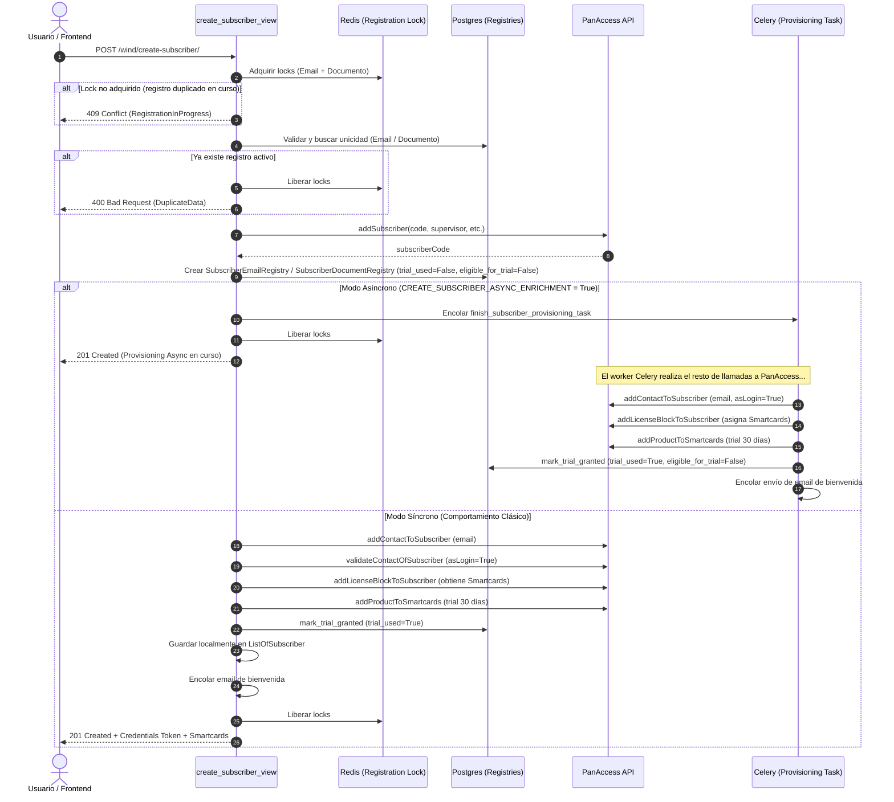
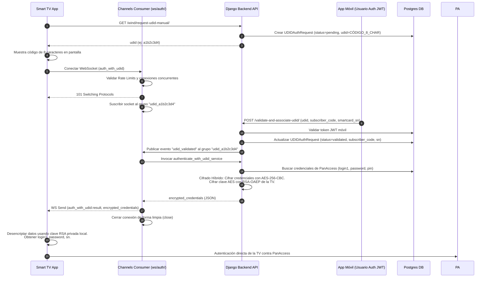
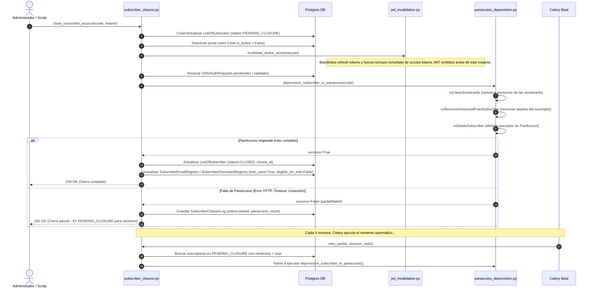

# Auditoría Técnica Completa: Integración PanAccess - Wind (Backend)

Este documento presenta una auditoría técnica completa del sistema de integración entre **PanAccess** (sistema maestro de televisión, abonados, licencias y productos) y el cliente **Wind** (portal web, aplicaciones móviles y Smart TVs).

---

## 1. Entendimiento del Proyecto

El backend funciona como una **capa intermedia (middleware/proxy con caché)** para conectar las aplicaciones cliente de Wind con PanAccess. Esto responde a la necesidad de optimizar el rendimiento, garantizar la resiliencia y aplicar reglas de negocio propias de Wind que PanAccess no puede procesar nativamente de forma eficiente.

### Arquitectura General y Tecnologías Core

El sistema está construido sobre un stack de alto rendimiento y resiliencia:
- **Framework Web**: Django (Python) expone endpoints REST (`/api/`) para las apps y sirve vistas HTML (`/wind/`) para administración e inicialización.
- **Comunicación en Tiempo Real**: Django Channels (WebSockets) maneja la interacción con las Smart TVs para el proceso de emparejamiento (UDID).
- **Cola de Tareas Asíncronas**: Celery y Redis gestionan tareas de sincronización periódica, aprovisionamiento en segundo plano y reintentos automáticos.
- **Base de Datos**: PostgreSQL actúa como réplica local y caché persistente de los datos de abonados, smartcards y catálogo de productos de PanAccess.

```
       [ App Móvil / Web ]            [ Smart TV ]
                │                          │
         (HTTPS / JWT)              (WebSocket / UDID)
                ▼                          ▼
   ┌──────────────────────────────────────────────────┐
   │                  BACKEND WIND                    │
   │                                                  │
   │   ┌───────────────┐     ┌────────────────────┐   │
   │   │  Django Rest  │     │  Django Channels   │   │
   │   └───────┬───────┘     └─────────┬──────────┘   │
   │           │                       │              │
   │           ▼                       ▼              │
   │   ┌──────────────────────────────────────────┐   │
   │   │       Lógica de Negocio y Cierre         │   │
   │   └───────────────┬──────────────────────────┘   │
   │                   │                              │
   │       ┌───────────┴───────────┐                  │
   │       ▼                       ▼                  │
   │ ┌───────────┐           ┌───────────┐            │
   │ │  Celery   │◄─────────►│   Redis   │            │
   │ └─────┬─────┘  (Queue)  └─────┬─────┘            │
   │       │          (Lock)       │ (Session Cache)  │
   │       ▼                       ▼                  │
   │ ┌───────────┐           ┌───────────┐            │
   │ │ Postgres  │           │ Circuit   │            │
   │ │  (Cache)  │           │  Breaker  │            │
   │ └───────────┘           └───────────┘            │
   └───────┬───────────────────────┬──────────────────┘
           │                       │
      (getSubscriber)         (SOAP/REST APIs)
           ▼                       ▼
   ┌──────────────────────────────────────────────────┐
   │                    PANACCESS                     │
   └──────────────────────────────────────────────────┘
```

---

## 2. Análisis de Archivos y Funcionalidades

A continuación, se detalla el propósito y la lógica de cada componente principal del backend:

### 2.1 Módulos y Directorios Principales

| Ruta / Componente | Descripción y Funcionalidad Clave |
| :--- | :--- |
| [appConfig.py](file:///d:/Back-Wind-V2/appConfig.py) | **Sistema de Configuración**: Centraliza variables de entorno y variables de configuración para Django, Celery, Redis, PanAccess y políticas de correo. Valida que los parámetros indispensables estén configurados al arrancar. |
| [wind/models.py](file:///d:/Back-Wind-V2/wind/models.py) | **Base de Datos y Modelos**: Define la caché local (`ListOfSubscriber`, `ListOfSmartcards`, `ListOfProducts`), las credenciales cifradas (`SubscriberLoginInfo`), el perfil del abonado (`SubscriberInfo`), los registros de unicidad anti-fraude (`SubscriberEmailRegistry`, `SubscriberDocumentRegistry`), logs de auditoría y resets. |
| [wind/tasks.py](file:///d:/Back-Wind-V2/wind/tasks.py) | **Cola Asíncrona (Celery)**: Contiene los trabajos periódicos de sincronización (`periodic_sync_pipeline_task`), reconciliación (`compare_and_update_subscribers_task`), aprovisionamiento en background (`finish_subscriber_provisioning_task`) y envío de correos. |
| [wind/consumers.py](file:///d:/Back-Wind-V2/wind/consumers.py) | **WebSocket Consumer**: Orquesta la sesión persistente con las Smart TVs para el flujo de emparejamiento UDID, aplicando límites de conexiones globales y por dispositivo. |
| [wind/views.py](file:///d:/Back-Wind-V2/wind/views.py) | **Vistas del Portal e Integración**: Contiene endpoints HTML y APIs JSON de administración, diagnóstico y las vistas legacy del emparejamiento UDID. |
| [wind/services/](file:///d:/Back-Wind-V2/wind/services/) | **Capa de Servicios**: Aísla la lógica compleja de negocio para que no dependa directamente de las vistas. |
| [wind/functions/](file:///d:/Back-Wind-V2/wind/functions/) | **Acciones Procedimentales**: Contiene scripts específicos para llamar APIs concretas de PanAccess e interactuar con la base de datos local en lote. |
| [wind/utils/](file:///d:/Back-Wind-V2/wind/utils/) | **Utilidades Comunes**: Criptografía para TVs, formateo, utilidades de red, validación de teléfono/email y enrutamiento de logs. |

### 2.2 Funcionalidad Detallada de los Servicios (`wind/services/`)

- [panaccess_client.py](file:///d:/Back-Wind-V2/wind/services/panaccess_client.py): Cliente de bajo nivel para comunicarse con PanAccess mediante requests form-urlencoded. Implementa reintentos automáticos y backoff exponencial para fallas de red y timeouts, controlando la redacción de datos sensibles.
- [panaccess_singleton.py](file:///d:/Back-Wind-V2/wind/services/panaccess_singleton.py): Envuelve el cliente en una instancia única y segura en entornos multihilo. Coordina la adquisición concurrente del token de sesión compartida en Redis mediante locks bloqueantes y realiza una validación periódica (cada 15 min) en un hilo demonio.
- [panaccess_circuit_breaker.py](file:///d:/Back-Wind-V2/wind/services/panaccess_circuit_breaker.py): Implementa el patrón Circuit Breaker en Redis. Si ocurren fallos repetitivos de conectividad, rate limit o autenticación contra PanAccess, corta el tráfico temporalmente (60s) para evitar bloquear la cuenta de servicio completa.
- [subscriber_auth.py](file:///d:/Back-Wind-V2/wind/services/subscriber_auth.py): Autenticación de abonados. Resuelve credenciales locales (`SubscriberLoginInfo`), valida contra PanAccess si faltan en caché, interactúa con el modelo de usuarios de Django, verifica si la cuenta se cerró localmente y crea/asocia los usuarios.
- [subscriber_catalog.py](file:///d:/Back-Wind-V2/wind/services/subscriber_catalog.py): Encargado de construir las respuestas de perfil, smartcards y productos para las aplicaciones cliente. Funciona de manera **estrictamente asíncrona respecto a PanAccess**: si los datos de perfil faltan o están incompletos en Postgres, responde inmediatamente con la caché local y encola una tarea Celery para refrescar la información en segundo plano.
- [social_login_provisioning.py](file:///d:/Back-Wind-V2/wind/services/social_login_provisioning.py): Orquesta el registro y vinculación automáticos de usuarios que inician sesión mediante Google o Facebook. Simula peticiones internas hacia el endpoint de creación de abonados y extrae sus credenciales reales de PanAccess.
- [subscriber_closure.py](file:///d:/Back-Wind-V2/wind/services/subscriber_closure.py): Controla el cierre administrativo de cuentas. Coloca el estado de la fila local en `PENDING_CLOSURE`, desactiva usuarios Django, invalida sesiones JWT vigentes y delega el borrado físico del abonado a PanAccess.
- [panaccess_deprovision.py](file:///d:/Back-Wind-V2/wind/services/panaccess_deprovision.py): Realiza la secuencia exacta de desasociación y borrado en PanAccess: limpia smartcards (`cvCleanSmartcards`), desasocia la licencia, desactiva órdenes activas y finalmente elimina al suscriptor (`cvDeleteSubscriber`).
- [jwt_invalidation.py](file:///d:/Back-Wind-V2/wind/services/jwt_invalidation.py): Blacklistea refresh tokens y permite rechazar proactivamente access tokens JWT que ya fueron emitidos antes del cambio de contraseña o de un cierre de cuenta.
- [password_reset.py](file:///d:/Back-Wind-V2/wind/services/password_reset.py): Gestión de tokens y estados para recuperación de contraseña, utilizando la base de datos local para impedir la reutilización de enlaces.

---

## 3. Flujos Funcionales del Sistema

### 3.1 Flujo de Registro de Abonado (Con Trial de 30 Días)

El registro puede realizarse de forma síncrona o asíncrona (`CREATE_SUBSCRIBER_ASYNC_ENRICHMENT`):



### 3.2 Flujo de Emparejamiento Smart TV (UDID Flow)

Permite a un televisor iniciar sesión en PanAccess mediante la confirmación del usuario desde un dispositivo móvil:



### 3.3 Flujo de Cierre de Cuenta Administrativo

Este flujo garantiza la inhabilitación del acceso y el borrado seguro e idempotente:



---

## 4. Debilidades y Vulnerabilidades Encontradas

A continuación, se listan los hallazgos agrupados por severidad técnica.

### 4.1 Vulnerabilidades Críticas (CRITICAL)

#### 1. Clave Privada Estática Embebida en Aplicaciones Cliente (Smart TVs)
- **Ubicación:** [crypto_tv.py (hybrid_encrypt_for_app)](file:///d:/Back-Wind-V2/wind/utils/crypto_tv.py#L68-L117)
- **Descripción:** El backend realiza un cifrado híbrido utilizando claves RSA configuradas por tipo de aplicación (`AppCredentials`). La TV recibe las credenciales del abonado cifradas con la clave pública de la app, lo que significa que el descifrado requiere la **clave privada** correspondiente, la cual debe estar embebida estáticamente dentro del código binario/fuente de la aplicación instalada en el televisor (o viceversa).
- **Riesgo:** Si un tercero extrae la clave privada del instalador de la app (LG, Samsung o Android TV), podrá interceptar y descifrar el tráfico de red de cualquier televisor que intente emparejarse, obteniendo las credenciales de PanAccess en texto plano de cualquier abonado.
- **Prueba de Concepto (PoC) Teórica:** Un atacante descomprime el paquete `.apk` o `.ipk` de la app de TV, extrae la clave privada RSA PEM e intercepta el tráfico del WebSocket. Con la clave, descifra el campo `encrypted_key` para obtener la clave AES y finalmente descifra `encrypted_data`.

#### 2. Credenciales en Texto Plano en la Respuesta de Login Social
- **Ubicación:** [social_login_provisioning.py (build_panaccess_credentials)](file:///d:/Back-Wind-V2/wind/services/social_login_provisioning.py#L129-L154) y [auth_views.py](file:///d:/Back-Wind-V2/wind/auth_views.py)
- **Descripción:** Debido a que el backend no implementa un Session Broker para actuar en nombre de los clientes, cuando un usuario inicia sesión con Google o Facebook, el backend busca en PanAccess las credenciales reales (`login1`, `password`, `login2`) y las devuelve en texto plano en el JSON de respuesta.
- **Riesgo:** Cualquier intermediario (log del servidor, herramientas APM de monitoreo de red, proxy HTTP, o almacenamiento local del dispositivo) que capture esta petición tendrá acceso a la contraseña del abonado principal en PanAccess, permitiendo el secuestro de la cuenta.

#### 3. Contraseña Enviada en Texto Plano por Correo Electrónico
- **Ubicación:** [welcome_email.py](file:///d:/Back-Wind-V2/wind/services/welcome_email.py)
- **Descripción:** Cuando se registra un abonado, se le envía un correo electrónico de bienvenida que incluye explícitamente su identificador `login1` y su contraseña de PanAccess en texto plano.
- **Riesgo:** El correo electrónico es un medio de transporte inseguro. Si el servidor SMTP del destinatario no utiliza TLS, o si la bandeja de entrada del usuario es comprometida, las credenciales reales de televisión y cuenta quedan expuestas directamente.

---

### 4.2 Vulnerabilidades Altas (HIGH)

#### 1. Bypass de Restricción por IP mediante Falseo de `X-Forwarded-For`
- **Ubicación:** [sync_admin_ip_middleware.py (_client_ip)](file:///d:/Back-Wind-V2/wind/middleware/sync_admin_ip_middleware.py#L31-L36)
- **Descripción:** Para proteger endpoints de sincronización y diagnóstico (`_PROTECTED_PREFIXES`), el middleware lee la IP del cliente utilizando el encabezado `HTTP_X_FORWARDED_FOR` de manera prioritaria. Sin embargo, Django no valida si la petición proviene de un proxy de confianza (como el nginx local de producción).
- **Riesgo:** Un atacante puede enviar una petición directa al puerto de Daphne/Django inyectando un encabezado `X-Forwarded-For: 127.0.0.1` (o una IP permitida en el allowlist) para saltarse por completo el filtro y acceder a rutas administrativas y de sincronización.

#### 2. Bug Funcional en el Endpoint HTTP de Smart TV (UDID)
- **Ubicación:** [views.py (AuthenticateWithUDIDView)](file:///d:/Back-Wind-V2/wind/views.py#L454)
- **Descripción:** El endpoint HTTP clásico para Smart TVs invoca la función inexistente `json.serialize_credentials(credentials_payload)`.
- **Riesgo:** Intentar utilizar el flujo de emparejamiento HTTP tradicional causará un error `500 Internal Server Error` debido a un `AttributeError: module 'json' has no attribute 'serialize_credentials'`.

#### 3. Condiciones de Carrera en Altas de Login Social
- **Ubicación:** [social_login_provisioning.py (ensure_subscriber_for_social_email)](file:///d:/Back-Wind-V2/wind/services/social_login_provisioning.py#L79-L127)
- **Descripción:** El aprovisionamiento para el login social valida si el usuario existe localmente antes de crearlo en PanAccess, pero **no adquiere locks** distribuidos ni locales como sí lo hace la vista de registro tradicional (`create_subscriber_view`).
- **Riesgo:** Si un usuario realiza peticiones concurrentes simultáneas de login social por primera vez, se podrían intentar registrar múltiples abonados diferentes en PanAccess bajo el mismo correo, generando inconsistencias y duplicación de licencias asignadas.

---

### 4.3 Vulnerabilidades Medias (MEDIUM)

#### 1. Exposición a Login-Storms en la Autenticación de Paginación Inexistente
- **Ubicación:** [subscriber_auth.py (_discover_login_by_login1)](file:///d:/Back-Wind-V2/wind/services/subscriber_auth.py#L89-L155)
- **Descripción:** Si un usuario intenta iniciar sesión proporcionando un `login1` que no existe localmente, el backend realiza múltiples llamadas iterativas paginadas a PanAccess (hasta `LOGIN_DISCOVERY_MAX_CALLS`, 40 por defecto) para buscar el código del suscriptor en vivo.
- **Riesgo:** Un atacante enviando múltiples peticiones aleatorias de inicio de sesión con identificadores inexistentes obligará al backend a saturar la API de PanAccess, disparando el rate limit (20 logins en 5 minutos) y denegando el servicio a todos los usuarios legítimos.

#### 2. Dependencia de Tokens JWT Huérfanos durante Caídas de Base de Datos
- **Ubicación:** [jwt_invalidation.py](file:///d:/Back-Wind-V2/wind/services/jwt_invalidation.py)
- **Descripción:** El sistema utiliza la base de datos como fuente de verdad del timestamp `password_changed_at` para verificar la validez de los tokens JWT de acceso.
- **Riesgo:** Si la base de datos experimenta una caída momentánea y el middleware de autenticación falla al obtener el perfil de seguridad del usuario, podría caer en un estado de denegación de servicio (DoS) para usuarios autenticados legítimos, o alternativamente permitir accesos sin validar si no se maneja la excepción de forma estricta.

#### 3. Circuit Breaker Fallando "Abierto" en Errores de Redis
- **Ubicación:** [panaccess_circuit_breaker.py](file:///d:/Back-Wind-V2/wind/services/panaccess_circuit_breaker.py#L66-L74)
- **Descripción:** Si ocurre una falla de comunicación con Redis, la lectura del estado del circuit breaker atrapa la excepción y asume que el circuito está "cerrado".
- **Riesgo:** En caso de degradación de Redis, el circuit breaker dejará de proteger a PanAccess, permitiendo que tormentas de peticiones sigan golpeando a la API externa de forma descontrolada.

---

### 4.4 Vulnerabilidades Bajas (LOW)

#### 1. Timeouts Celery sin Límite Duro en full_sync_task
- **Ubicación:** [tasks.py (full_sync_task)](file:///d:/Back-Wind-V2/wind/tasks.py#L384-L403)
- **Descripción:** Por solicitud de negocio, la tarea de sincronización total no tiene límites de tiempo para evitar ser cancelada en catálogos extensos.
- **Riesgo:** Si la tarea Celery entra en un bucle infinito o PanAccess responde de manera extremadamente lenta, el hilo de Celery quedará ocupado indefinidamente hasta reiniciar manualmente el worker, reduciendo la disponibilidad de tareas.

#### 2. Mutaciones de Estado y Mocks en Tests
- **Ubicación:** [test_panaccess_deprovision.py](file:///d:/Back-Wind-V2/wind/tests/test_panaccess_deprovision.py)
- **Descripción:** Los mocks de las respuestas API en los tests unitarios simulan respuestas fijas de PanAccess que podrían diferir de las firmas reales del WSDL si la plataforma externa cambia de versión.

---

## 5. Puntos de Mejora y Recomendaciones de Seguridad

Para robustecer el sistema y mitigar los hallazgos, se recomiendan las siguientes acciones:

### 5.1 Recomendaciones Críticas (Mitigación Inmediata)

1. **Implementar Intercambio de Llaves Dinámico (Diffie-Hellman / RSA por Dispositivo):**
   - **Acción:** No almacene la clave privada en la aplicación de Smart TV.
   - **Solución:** Cuando la Smart TV se instale por primera vez, debe generar su propio par de claves RSA localmente. Al solicitar el UDID (`request-udid-manual`), debe enviar su clave **pública** al backend. El backend utilizará esa clave pública específica para cifrar las credenciales del emparejamiento. Así, la clave privada de descifrado pertenece únicamente al dispositivo físico del televisor y no está compartida en el instalador.

2. **Implementar Backend Session Broker (Capa de Autenticación Propia):**
   - **Acción:** Dejar de exponer contraseñas reales de PanAccess en JSON al cliente.
   - **Solución:** Modifique la arquitectura de autenticación. El backend de Wind debe generar y validar sus propios tokens de sesión (como los JWT existentes). Cuando la aplicación cliente necesite reproducir contenido, debe pasar su token JWT local al backend, y el backend utilizará la sesión maestra persistente de PanAccess para autorizar la reproducción mediante APIs internas o la generación de tokens de reproducción efímeros (PlayReady/Widevine/etc.), evitando que el cliente manipule contraseñas crudas de PanAccess.

3. **Eliminar Contraseñas de Correos de Bienvenida:**
   - **Acción:** Cambiar flujo de bienvenida.
   - **Solución:** Enviar un enlace temporal de activación/establecimiento de contraseña segura al registrarse, en lugar de generar una contraseña automática y mandarla por correo electrónico de manera insegura.

### 5.2 Mejoras de Infraestructura y Código

- **Resolver Trusted Proxies en Middleware de IP:**
  - Instalar y configurar `django-ipware` para determinar de manera segura la IP del cliente final.
  - Asegurar que la IP solo se tome de `X-Forwarded-For` si la petición proviene estrictamente de las IPs de los balanceadores o proxies configurados (ej: `127.0.0.1` si Nginx está en la misma máquina).
- **Corregir el Bug de `json.serialize_credentials`:**
  - Reemplazar la línea 454 de [views.py](file:///d:/Back-Wind-V2/wind/views.py) por la función serializadora ya existente en los servicios del UDID:
    ```python
    from wind.services.udid_auth_service import json_serialize_credentials
    # ...
    encrypted_result = hybrid_encrypt_for_app(
        json_serialize_credentials(credentials_payload), app_type
    )
    ```
- **Aplicar Locks en Login Social:**
  - Utilizar el mismo decorador y lógica de lock distribuido de Redis en `ensure_subscriber_for_social_email` para evitar duplicaciones por clicks o peticiones concurrentes del cliente.
- **Control de Tormentas en `_discover_login_by_login1`:**
  - Reducir significativamente `LOGIN_DISCOVERY_MAX_CALLS` o, preferiblemente, inhabilitar la paginación reactiva en el login. Si un usuario no está en la base de datos local, se debe asumir que no existe hasta que se complete una sincronización periódica, o limitar su consulta a un solo endpoint no paginado en PanAccess.
