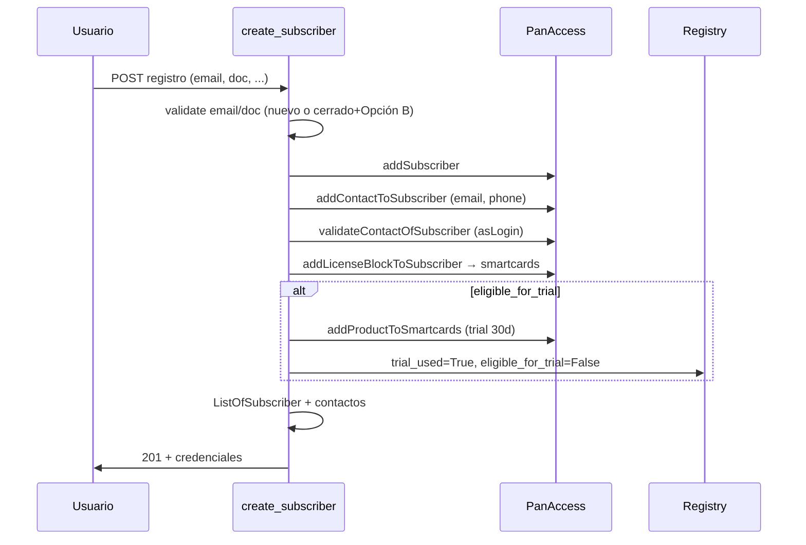
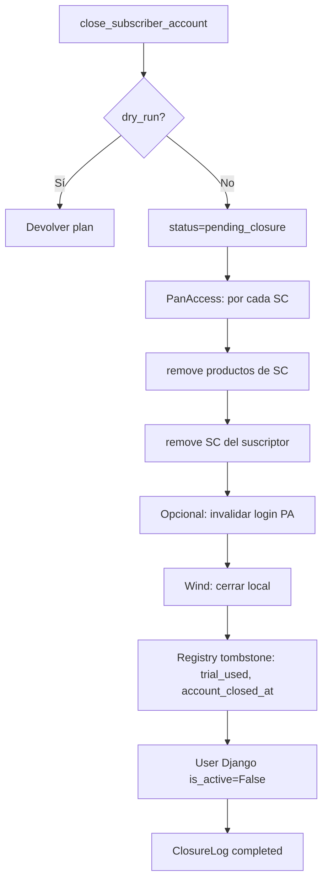

# Cierre de cuenta, trial único y re-registro (Opción B)

**Estado:** implementación en curso — Fase 1 y 2 base en código; Fase 3 PanAccess (nombres API por confirmar); Fase 4 HTTP pendiente.

Documento de referencia para el ciclo de vida del abonado: registro con trial, cierre voluntario, anti-abuso y re-alta sin segundo periodo de prueba.

---

## 1. Objetivos de negocio

| Regla | Descripción |
|-------|-------------|
| **Primer registro** | Siempre: smartcards (license block) + producto trial 30 días. |
| **Cierre de cuenta** | Solo cuando el usuario lo solicita (día 5, 30 o después del trial). No es borrado físico. |
| **Re-registro (Opción B)** | Mismo email/documento puede volver a registrarse, **sin** segundo trial. |
| **Anti-abuso** | `SubscriberEmailRegistry` / `SubscriberDocumentRegistry` no se borran al cerrar; conservan `trial_used`. |
| **PanAccess** | Fuente de verdad del acceso; al cerrar: **1) quitar productos de tarjetas → 2) quitar tarjetas del suscriptor**. |

---

## 2. Arquitectura de módulos

| Módulo | Responsabilidad |
|--------|-----------------|
| `wind/services/subscriber_trial.py` | Elegibilidad trial, marcar `trial_used`, días de prueba. |
| `wind/services/panaccess_deprovision.py` | Llamadas PanAccess: remove productos → remove smartcards. |
| `wind/services/subscriber_closure.py` | Orquestador `close_subscriber_account()`. |
| `wind/utils/email_validation.py` | Validación registro/re-registro (Opción B). |
| `wind/functions/create_subscriber.py` | Registro; trial condicional; persistencia contactos. |
| `wind/functions/getSubscriber.py` | `delete_subscriber_operational_data()` sin borrar registry. |
| `wind/management/commands/close_subscriber.py` | CLI admin con `--dry-run`. |

---

## 3. Modelo de datos

### 3.1 `SubscriberEmailRegistry` / `SubscriberDocumentRegistry`

Campos nuevos:

| Campo | Tipo | Uso |
|-------|------|-----|
| `trial_used` | bool | `True` tras conceder el primer trial. |
| `trial_granted_at` | datetime | Inicio del trial. |
| `trial_expires_at` | datetime | Fin (granted + 30 días). |
| `eligible_for_trial` | bool | `False` tras primer trial; no se resetea al cerrar. |
| `account_closed_at` | datetime | Cuándo el usuario cerró la cuenta. |
| `closed_subscriber_code` | str | Último código PanAccess antes del cierre. |

Campos existentes:

| Campo | Uso |
|-------|-----|
| `has_purchased` | Si pagó, reglas de re-alta según negocio (sin cambio). |
| `subscriber_code` | Código activo o último conocido. |

### 3.2 `ListOfSubscriber`

| Campo | Valores | Uso |
|-------|---------|-----|
| `status` | `active` \| `closed` \| `pending_closure` | Evitar que sync “reviva” cuentas cerradas. |
| `closed_at` | datetime | Fecha de cierre local. |
| `closed_reason` | text | Motivo (usuario, admin, etc.). |

### 3.3 `SubscriberClosureLog` (auditoría)

| Campo | Uso |
|-------|-----|
| `subscriber_code` | Código afectado. |
| `requested_by` | User admin o null (autoservicio futuro). |
| `reason` | Texto libre. |
| `dry_run` | Si fue simulación. |
| `panaccess_result` | JSON (productos/SC removidos). |
| `local_result` | JSON (tablas tocadas). |
| `status` | `completed` \| `partial` \| `failed` |
| `created_at` | Timestamp. |

---

## 4. Flujo: primer registro



**Invariante:** usuario nuevo (`trial_used=False`) **siempre** recibe license block + producto trial si `addLicenseBlock` devuelve smartcards.

---

## 5. Flujo: cierre de cuenta

Disparador: petición explícita del usuario (o admin). Puede ocurrir en cualquier momento del ciclo de trial.



### 5.1 PanAccess (orden fijo)

1. `getSubscriber` / extended → listar smartcards.
2. Por cada smartcard: listar productos → **remove productos**.
3. Por cada smartcard: **remove smartcard del suscriptor**.
4. (Opcional) `resetSubscriberPassword` / quitar contacto login.

Nombres de API configurables en `.env` (confirmar con documentación PanAccess):

```env
PANACCESS_REMOVE_PRODUCT_API=removeProductFromSmartcard
PANACCESS_REMOVE_SMARTCARD_API=removeSmartcardFromSubscriber
```

### 5.2 Wind (local)

| Acción | Tabla |
|--------|-------|
| `status=closed`, `smartcards=[]` | `ListOfSubscriber` |
| DELETE | `SubscriberLoginInfo` |
| DELETE / anonimizar | `SubscriberInfo` |
| `is_active=False` | `User` |
| `revoked` | `UDIDAuthRequest` |
| **NO DELETE** — actualizar tombstone | `SubscriberEmailRegistry`, `SubscriberDocumentRegistry` |
| INSERT | `SubscriberClosureLog` |

---

## 6. Flujo: re-registro (Opción B)

Condiciones para **permitir** registro con email/documento ya vistos:

- `account_closed_at` no es null **y** cuenta no activa en `ListOfSubscriber`, **o**
- `has_purchased=True` (regla existente).

Condiciones para **denegar**:

- Registry existe, cuenta **activa** (`status=active` en `ListOfSubscriber`).
- Registry existe, `trial_used=True`, **sin** cierre previo.

Al re-registrar:

- Se crea nuevo suscriptor en PanAccess (nuevo código o política de reactivación).
- **No** se ejecuta `addProductToSmartcards` trial si `eligible_for_trial=False`.
- License block puede ejecutarse (smartcards sin producto trial).
- Registry se **actualiza** (`subscriber_code`, fechas); **no** se borra.

Mensaje sugerido al usuario: *"Tu periodo de prueba ya fue utilizado. Puedes continuar con un plan de pago."*

---

## 7. Validaciones en `create_subscriber`

| Check | Comportamiento |
|-------|----------------|
| Email en registry, cuenta activa | 400 DuplicateData |
| Email en registry, `account_closed_at` set | Permitir (Opción B) |
| Documento en registry, cuenta activa | 400 DuplicateData |
| Documento en registry, cerrado | Permitir (Opción B) |
| `ListOfSubscriber.emails` con `status=active` | 400 |
| `ListOfSubscriber.emails` solo en `status=closed` | Permitir |
| `eligible_for_trial` | Controla bloque `addProductToSmartcards` |

---

## 8. Sync y full-sync

- No reactivar suscriptores con `status=closed` desde PanAccess sin intervención.
- `full_sync` no debe borrar registry (solo huérfanos en `ListOfSubscriber` respecto a PanAccess).
- Cierre parcial en PA → log `partial` + reintento Celery.

---

## 9. Configuración `.env`

```env
# Trial
REGISTRATION_TRIAL_DAYS=30
PANACCESS_REGISTRATION_PRODUCT_ID=1

# Cierre de cuenta (HTTP admin, fase 4)
CLOSE_SUBSCRIBER_HTTP_ENABLED=false

# APIs PanAccess deprovision (confirmar nombres reales)
PANACCESS_REMOVE_PRODUCT_API=removeProductFromSmartcard
PANACCESS_REMOVE_SMARTCARD_API=removeSmartcardFromSubscriber
```

---

## 10. Fases de implementación

| Fase | Entregable | Estado |
|------|------------|--------|
| **1** | Migración, `subscriber_trial.py`, validación Opción B, `create_subscriber` trial condicional | Hecho |
| **2** | `subscriber_closure.py` cierre local, tombstone registry, comando `close_subscriber` | Hecho (base) |
| **3** | `panaccess_deprovision.py`, integración PA, reintentos | En código (confirmar APIs PA) |
| **4** | Endpoint HTTP admin, autoservicio dashboard | Pendiente |
| **5** | Sync ignora `closed`, tests E2E, README | Hecho (sync no borra/reactiva `closed`/`pending_closure`) |

---

## 11. Comandos previstos

```bash
# Simular cierre
python manage.py close_subscriber --code 1120743001 --dry-run

# Ejecutar cierre
python manage.py close_subscriber --code 1120743001 --reason "Solicitud usuario"

# Registro (sin cambio de URL)
POST /wind/create-subscriber/
```

---

## 12. Relación con funcionalidad ya implementada

| Ya en producción | Compatible con este plan |
|------------------|---------------------------|
| Email/teléfono en `ListOfSubscriber` tras registro | Sí |
| Email como usuario (correo + credenciales) | Sí |
| Verificación email portal (`mark_portal_email_verified`) | Sí |
| Mensaje error teléfono en formulario | Sí |
| `has_purchased` en registry | Se mantiene; distinto de `trial_used` |

---

## 13. Decisiones cerradas

1. **Primer registro:** siempre smartcards + trial 30 días.
2. **Cierre:** desaprovisionar PA (productos → tarjetas), tombstone local.
3. **Re-registro:** Opción B — permitido sin segundo trial.
4. **Registry:** nunca borrar en cierre de usuario.

---

## 14. Pendiente de confirmar con PanAccess

- Nombre exacto de APIs `removeProduct*` y `removeSmartcard*`.
- Parámetros (productId, sn, subscriber code).
- Si hace falta quitar contacto email del suscriptor cerrado antes de re-registro con mismo email.
- Comportamiento de `addLicenseBlockToSubscriber` en re-registro sin trial.
