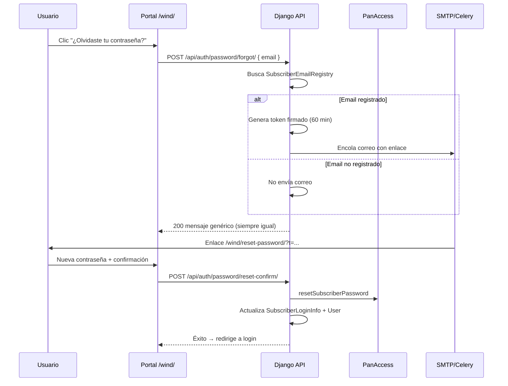

# Recuperación de contraseña (Olvidé mi contraseña)

**Estado:** implementado.

Documento de referencia para el flujo público de recuperación de contraseña Wind/PanAccess.

---

## 1. Objetivo

Permitir que un suscriptor que **olvidó su contraseña** la restablezca sin estar autenticado, usando su **correo electrónico** registrado en `SubscriberEmailRegistry`.

La contraseña de acceso a TV y apps proviene de **PanAccess** (fuente de verdad). El reset debe ejecutarse vía `resetSubscriberPassword` y luego sincronizar la caché local (`SubscriberLoginInfo`) y el `User` Django vinculado.

> **No se usa** el reset de `dj-rest-auth` (`/api/auth/password/reset/`), porque solo modifica la contraseña Django y no la de PanAccess.

---

## 2. Flujo de usuario



### Pantallas

| Ruta | Descripción |
|------|-------------|
| `/wind/login/` | Enlace **¿Olvidaste tu contraseña?** |
| `/wind/forgot-password/` | Formulario de correo |
| `/wind/reset-password/?t=TOKEN` | Formulario de nueva contraseña |

### Mensajes en UI

- **Tras enviar el correo:** respuesta genérica de seguridad: *"Si el correo está registrado en Wind, recibirás un enlace…"* (no revela si el email existe).
- **Aviso fijo** en la página de recuperación: *"¿Nunca te registraste? Crea una cuenta aquí"* con enlace a registro.

---

## 3. Componentes implementados

| Componente | Ubicación |
|------------|-----------|
| Lógica central | `wind/services/password_reset.py` |
| API forgot / confirm | `wind/api/password_reset/views.py` |
| Serializers | `wind/api/password_reset/serializers.py` |
| URLs API | `wind/api/password_reset/urls.py` → montadas en `panaccess_wind_integration/urls.py` |
| Tarea Celery | `wind/tasks.py` → `send_password_reset_email_task` |
| Páginas web | `wind/templates/wind/forgot-password.html`, `reset-password.html` |
| Vistas HTML | `wind/views.py` → `forgot_password_view`, `reset_password_view` |
| Throttle | `wind/throttles.py` → `PasswordResetThrottle` (5/h por IP) |
| Sync post-cambio | `sync_password_locally()` reutilizada en perfil y legacy |

---

## 4. API

### Solicitar recuperación

```
POST /api/auth/password/forgot/
Content-Type: application/json

{ "email": "usuario@ejemplo.com" }
```

**Respuesta (siempre 200 si el email es válido):**

```json
{
  "success": true,
  "message": "Si el correo está registrado en Wind, recibirás un enlace para restablecer tu contraseña..."
}
```

### Confirmar nueva contraseña

```
POST /api/auth/password/reset-confirm/
Content-Type: application/json

{
  "token": "<token del enlace>",
  "newPass": "NuevaClave123!",
  "confirmPass": "NuevaClave123!"
}
```

**Éxito (200):**

```json
{
  "success": true,
  "message": "Contraseña actualizada correctamente. Ya puedes iniciar sesión."
}
```

**Errores comunes (400):** token expirado, ya usado o inválido.

---

## 5. Seguridad

| Medida | Detalle |
|--------|---------|
| Anti-enumeración | Misma respuesta HTTP y mensaje aunque el email no exista |
| Token firmado | `TimestampSigner` salt `wind.password-reset`, TTL 60 min |
| Un solo uso | Hash del token guardado en Redis (`password_reset:used:*`) |
| Throttling | `DRF_THROTTLE_PASSWORD_RESET` (default `5/hour` por IP) |
| Contraseña | Mínimo 8 caracteres; confirmación obligatoria |

---

## 6. Variables de entorno

Reutiliza la configuración SMTP existente (`EMAIL_HOST`, `EMAIL_HOST_USER`, etc.).

Opcional:

```env
DRF_THROTTLE_PASSWORD_RESET=5/hour
```

**Requisitos de runtime:**

- Celery worker activo (envío asíncrono del correo).
- Redis (marcar tokens usados; opcional pero recomendado).

---

## 7. Relación con otros flujos

| Flujo | Diferencia |
|-------|------------|
| Cambio autenticado (`POST /api/v1/profile/password/`) | Usuario ya logueado con JWT; mismo `resetSubscriberPassword` |
| Registro (`/wind/create-subscriber/`) | Crea credenciales nuevas; no es recuperación |
| `dj-rest-auth` password reset | Solo Django User; **no usar** para Wind/PanAccess |

Tras cualquier cambio de contraseña (perfil o recuperación), `sync_password_locally()` actualiza `SubscriberLoginInfo.password_hash` y `User.set_password()`.

---

## 8. Pruebas

```bash
python manage.py test wind.tests.test_password_reset
```

Casos cubiertos: email registrado/no registrado (respuesta genérica), confirmación exitosa, token inválido, mismatch de contraseñas.

---

## 9. Prueba manual

1. Asegurar SMTP y Celery en `.env`.
2. Abrir `/wind/forgot-password/`.
3. Ingresar un email presente en `SubscriberEmailRegistry`.
4. Revisar bandeja de entrada (o consola si `EMAIL_BACKEND` es consola).
5. Abrir el enlace, definir nueva contraseña.
6. Iniciar sesión en `/wind/login/` con la nueva clave.
