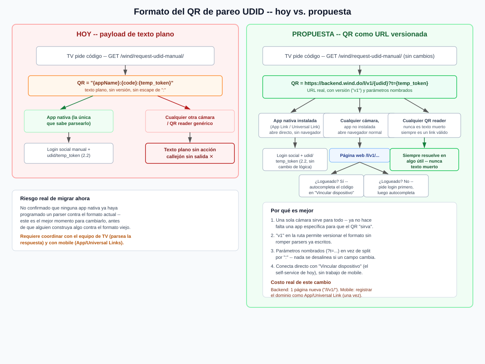

# Propuesta: formato de QR versionado para el pareo UDID (hallazgo #34)

Fecha: 2026-09-02
Referencia: `docs/GUIA_INTEGRACION_UNIFICADA.md` (sección 1.1.1, formato actual documentado), `docs/AUDITORIA_CONSOLIDADA_2026-08-24.md` (hallazgo #34), `docs/PAREO_UDID_AUTOSERVICIO_CUENTA_2026-09-02.md`.

**Estado (actualizado 2026-09-03): implementada la parte backend + `appVideo`.** Ver `docs/IMPLEMENTACION_FORMATO_QR_URL_2026-09-03.md` para el detalle de qué se hizo, verificación y qué queda afuera (configurar App/Universal Links del lado de mobile sigue siendo una decisión/trabajo de ese equipo, no algo que se haya hecho acá).



## El problema con el formato actual

Documentado en detalle en `GUIA_INTEGRACION_UNIFICADA.md` sección 1.1.1. En resumen: el QR de la TV codifica `"{appName}:{udid}:{temp_token}"`, un string plano armado y parseado únicamente por `appVideo` (`LoginPage.jsx`). Tres problemas concretos:

1. **No es un contrato, es un detalle de implementación.** Nunca se escribió en ningún documento hasta hoy -- cualquier equipo de mobile tenía que leer el código fuente de `appVideo` para saber qué esperar.
2. **Es frágil.** Separa por `:` sin escapar nada; `appName` es texto libre de configuración de marca y no hay garantía de que nunca contenga un `:`.
3. **No tiene versión** y **no es una URL** -- si se escanea con cualquier cámara que no sea la app nativa específica que lo entiende, es un callejón sin salida (texto plano sin acción).

El tercer punto se volvió más relevante hoy: con `docs/PAREO_UDID_AUTOSERVICIO_CUENTA_2026-09-02.md` ya existe una forma de completar el pareo sin ninguna app (tipeando el código en el dashboard web) -- pero el QR no puede aprovechar ese camino porque no es un link.

## Propuesta

Cambiar el payload del QR de un string plano a una URL real y versionada:

```
https://backend.wind.do/l/v1/{udid}?t={temp_token}
```

(`/l/v1/` es solo un ejemplo de ruta -- el nombre exacto es una decisión de producto, no técnica.)

Esto no cambia nada del lado del backend que ya existe (`request-udid-manual`, `ws/auth/`, `validate-and-associate-udid`, `associate-udid-by-account`) -- agrega una única página/vista nueva que decodifica la URL y decide qué hacer:

- **App nativa instalada, con el dominio configurado como App Link (Android) / Universal Link (iOS):** el sistema operativo abre la app directo, sin pasar por el navegador. La app extrae `udid`+`temp_token` de la URL (en vez de parsear un string arbitrario) y sigue exactamente el mismo flujo ya documentado en 2.2 (login social + esos dos campos). **Cero cambio de lógica de negocio**, solo cambia de dónde saca los dos valores.
- **Cualquier cámara, app no instalada o sin Universal Link configurado:** abre el navegador normal en esa URL. La página, si detecta sesión iniciada (cookie/JWT del dashboard), autocompleta el código en la sección "Vincular dispositivo" (`docs/PAREO_UDID_AUTOSERVICIO_CUENTA_2026-09-02.md`) y solo pide confirmar. Si no hay sesión, pide login primero y después autocompleta.
- **Cualquier lector de QR genérico:** siempre resuelve en un link válido -- nunca en texto muerto, a diferencia de hoy.

## Por qué ahora es un buen momento

No hay confirmación de que ninguna app nativa (iOS/Android) haya programado ya un parser contra el formato actual -- la integración mobile de 2.2 sigue pendiente según la última coordinación documentada. Cambiar el formato ahora, antes de que alguien construya algo contra el viejo, es mucho más barato que migrarlo después.

## Costo y qué requiere cada lado

| Lado | Trabajo |
|---|---|
| Backend (Wind) | **Hecho (2026-09-03)** -- `link_device_view` resuelve `/wind/l/v1/{udid}/`, valida el formato, y redirige a `/wind/dashboard/?link_tv={udid}` (pasando primero por `/wind/login/?next=...` si no había sesión). Ver `docs/IMPLEMENTACION_FORMATO_QR_URL_2026-09-03.md`. |
| Mobile (iOS/Android) | **Pendiente, fuera de mi alcance.** Configurar el dominio `backend.wind.do` como App Link / Universal Link (`assetlinks.json` / `apple-app-site-association`) -- trabajo de ese equipo, no de este repo. Sin esto, la URL igual funciona (abre en el navegador), solo no intercepta directo a la app nativa. |
| TV (`appVideo`) | **Hecho (2026-09-03)** -- `buildUdidQr` en `LoginPage.jsx` arma la URL en vez del string plano, con fallback al formato viejo si `baseUrl` no está configurado. |

## Qué no cambia

- El `temp_token` sigue siendo el secreto real del pareo -- la URL solo lo transporta, no cambia su rol ni su expiración (5 minutos).
- El flujo 2.2 (login social + `udid`/`temp_token` en el body) sigue exactamente igual -- esto es un cambio de *transporte* del QR, no de la lógica de asociación.
- `docs/PAREO_UDID_AUTOSERVICIO_CUENTA_2026-09-02.md` (auto-servicio por cuenta) no depende de este cambio para funcionar -- ya funciona hoy con el código corto tipeado a mano. Esta propuesta lo mejora (autocompletar en vez de tipear) pero no lo reemplaza.

## Qué falta para decidir esto (no es una decisión técnica solamente)

1. Confirmar con el equipo de TV si están de acuerdo en cambiar el formato del QR que generan hoy.
2. Confirmar con el equipo mobile si están dispuestos a configurar App/Universal Links (es trabajo real, aunque chico, y requiere acceso a los certificados/configuración de cada tienda).
3. Decidir el nombre real de la ruta y si conviene que la web de pareo viva bajo `backend.wind.do` o un dominio/subdominio propio.

Ninguno de estos tres puntos depende de mí -- son decisiones de producto/coordinación entre equipos. Si se aprueba, la implementación en sí es acotada.
